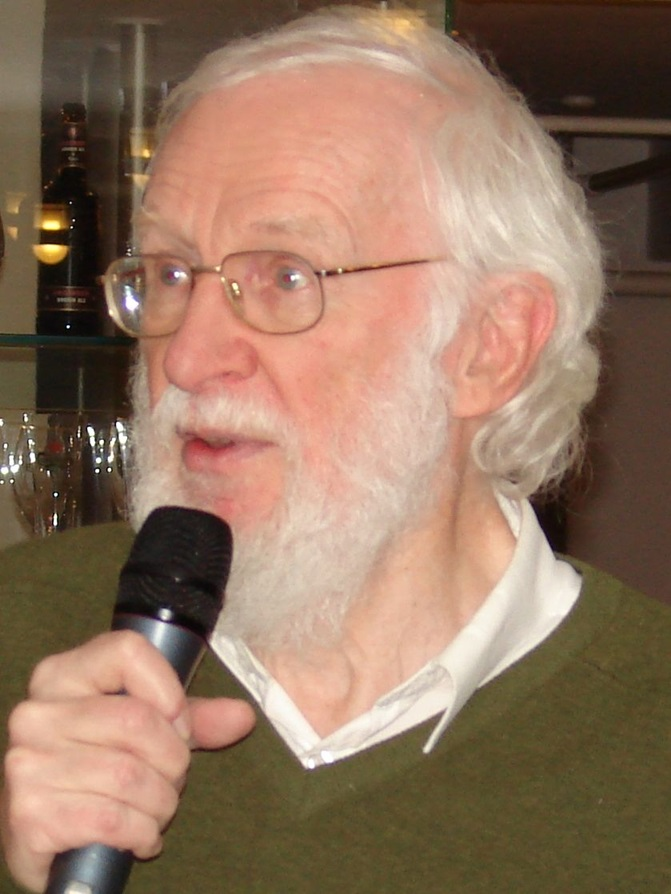

 # *ISPIRATORE: Peter Naur*

  
  

 

**Peter Naur** è stato un prestigioso informatico danese il cui lavoro ha radicalmente trasformato il campo della programmazione contribuendo a farlo evolvere in una disciplina scientifica
e introducendo solidi principi metodologici. Nel 2005, a 77 anni, gli è stato conferito il [*Turing Award*](https://amturing.acm.org/) per il ruolo cruciale svolto nello sviluppo di
linguaggi di programmazione e nella progettazione dei compilatori.

## *FORMAZIONE E CONTRIBUTI ALLA PROGRAMMAZIONE*
Inizialmente formatosi come **astronomo** presso l'Università di Copenhagen, Naur si dedicò all'informatica negli anni '50, quando i computer erano ancora agli albori. 
Lavorò presso l'Istituto Regnecentralen di Copenhagen, dove sviluppò successivamente un interesse per i linguaggi di programmazione.
  
Il contributo più rilevante di Naur fu il suo operato su [*Algol 60*](https://www.algol60.org/1home.htm), un linguaggio di programmazione innovativo che ha introdotto concetti fondamentali ancora oggi in uso:

  
<strong>🔹 Asserzioni e Programmazione Strutturata</strong>

  

   
Naur introdusse l’uso delle asserzioni (definite da lui *“istantanee generali”*) per verificare la conformità di un programma alle specifiche. Fu pioniere della ***programmazione strutturata***, promuovendo il controllo a blocchi e la definizione degli ambiti (*scoping*), eliminando l’uso incontrollato del comando *goto*. Questo approccio influenzò notevolmente studiosi come *Floyd*, *Dijkstra* e *Hoare*.

  

 

 
  
<strong>🔹 Definizione della sintassi (BNF)</strong>

  

Durante lo sviluppo di Algol 60, Naur si occupò di individuare una notazione adeguata per definire la sintassi del linguaggio. Sebbene il contributo di *Backus* nel 1959 rappresentasse uno dei primi tentativi per risolvere questo problema, inizialmente non riscosse molta attenzione.
Pochi mesi dopo, Peter Naur applicò quella notazione, dimostrandone l’efficacia pratica e apportando modifiche leggere ma significative per adattarla al nuovo linguaggio. È proprio in questo contesto che nacque la [***Backus Naur Form (BNF)***](https://dl.acm.org/doi/abs/10.5555/1074100.1074155), uno strumento fondamentale per la definizione formale della sintassi nei linguaggi di programmazione.

  

 

  
<strong>🔹 Realizzazione del compilatore GIER Algol</strong>

  

  
Insieme a Jørn Jensen, Naur sviluppò il compilatore [*GIER Algol*](https://link.springer.com/article/10.1007/BF01935579) che si distinse perché ottimizzava l'allocazione della memoria e la gestione delle procedure, implementava un rigoroso controllo dei tipi e introduceva il concetto di ***code coverage***, consentendo di monitorare l'esecuzione delle varie sezioni di codice per individuare eventuali aree non testate.
Questo approccio contribuì notevolmente a migliorare la robustezza e l'affidabilità del software.

  

Peter svolse un ruolo importante nell'affermare l'**informatica come disciplina accademica** e fu nominato *professor di Datalogi* (termine coniato da lui stesso) all'Università di Copenaghen. Sottolineò che l'informatica doveva essere considerata come lo studio dei dati e della loro elaborazione, piuttosto che semplicemente lo studio dei computer.
## *CONTRIBUTI NELL’INGEGNERIA DEL SOFTWARE*

  
<strong>🔸 Convegni NATO in risposta alla <i>“Crisi del software”</i></strong>

  

  
  Fu co-editore della [***NATO Software Engineering Conference***](https://dl.acm.org/doi/10.5555/1102020) del 1968 a Garmisch, evento che segnò l’avvento dell’ingegneria del software e mise in luce la *Crisi del software*, caratterizzata da progetti in ritardo, fuori budget e con numerosi difetti. Di qui il termine *"Ingegneria del software"* scelto provocatoriamente per suggerire che lo sviluppo software necessitasse dello stesso rigore applicato nelle discipline ingegneristiche tradizionali.

  

  
<strong>🔸 Influenza sul Manifesto per lo Sviluppo Agile</strong>

  

  
  Nel 1985, con la pubblicazione di [*Programming as Theory Building*](https://pablo.rauzy.name/dev/naur1985programming.pdf), sostenne che la programmazione consiste nella costruzione di una *“teoria” mentale* del problema e della sua soluzione, non solo nello scrivere codice.  
  Secondo Naur, questa teoria esiste principalmente nella mente del programmatore ed è difficile da trasferire attraverso la sola documentazione. Questa visione ha anticipato alcuni dei principi alla base del ***Manifesto per lo Sviluppo Agile*** come, ad esempio, la preferenza per un software funzionante piuttosto che per la documentazione.

  

  
<strong>🔸 Computer Versus Human Thinking</strong>

  

  
  Negli anni successivi ha esplorato temi che spaziano dalla psicologia alle neuroscienze e alla filosofia del linguaggio.  
  Tra le opere più note figura [*Computer Versus Human Thinking*](https://dl.acm.org/doi/pdf/10.1145/1188913.1188922) , che ha presentato in occasione della premiazione del Turing Award, evidenziando come la programmazione, pur fondandosi su rigore formale e precisione, richieda l’intuizione e la creatività umana.

  

La sua visione ha promosso un approccio *collaborativo* e *multidisciplinare* che promuove il ***dialogo*** e lo ***scambio di idee***; sono infatti questi i principi che costituiscono la base del nostro team e che ci hanno portato a scegliere Peter Naur come nostro ispiratore.

