# **MANUALE UTENTE**


## **INDICE**
1. [Introduzione](#1-introduzione)
2. [Regolamento degli Scacchi](#2-regolamento-degli-scacchi) <br/>
    2.1 [Movimenti dei pezzi](#-21-movimenti-dei-pezzi) <br/>
    2.2 [Regole Speciali](#-22-regole-speciali) <br/>
    2.3 [Scopo del gioco](#-23-scopo-del-gioco) <br/>
    2.4 [Notazione algebrica](#24-notazione-algebrica) <br/>
    2.5 [Esiti della partita](#-25-esiti-della-partita) <br/>
3. [Procedura preliminare](#3-procedura-preliminare) <br>
    3.1 [Creazione Token per il Docker login](#31-creazione-token-per-il-docker-login) <br/>
    3.2 [Docker Login con GitHub Access Token](#32-docker-login-con-github-access-token) <br/>
4. [Avvio applicazione](#4-avvio-applicazione) 
5. [Guida ai comandi](#5-guida-ai-comandi) <br/>
    5.1 [Help](#51-help) <br/>
    5.2 [Gioca](#52-gioca) <br/>
    5.3 [Scacchiera](#53-scacchiera) <br/>
    5.4 [Mosse](#54-mosse) <br/>
    5.5 [Abbandona](#55-abbandona) <br/>
    5.6 [Patta](#56-patta) <br/>
    5.7 [Esci](#57-esci) <br/>


## *1) Introduzione*
Benvenuti nell’universo degli **Scacchi**!♟️<br>
In questo documento troverete una guida completa per immergervi nell'arte degli scacchi: dalle regole fondamentali fino ai principi strategici più raffinati. Gli scacchi sono molto più di un semplice gioco da tavolo, sono una battaglia mentale dove intuizione, logica e previsione si intrecciano a ogni mossa.
Che tu sia un principiante curioso o un giocatore esperto in cerca di perfezionare il tuo stile, questa guida ti accompagnerà passo dopo passo in questa esperienza.


## *2) Regolamento degli scacchi*
Il gioco degli **Scacchi** si svolge tra due giocatori che muovono pezzi di diverso colore (bianco e nero) su una scacchiera quadrata di 64 caselle alternate nei colori chiaro e scuro.
### ♔ <ins>*La scacchiera e i pezzi*</ins>
La scacchiera viene disposta in modo che la casella d'angolo a destra di ciascun giocatore sia bianca
Ogni giocatore ha a disposizione 16 pezzi: *1 Re, 1 Donna (Regina), 2 Torri, 2 Alfieri, 2 Cavalli e 8 Pedoni*.
La posizione iniziale vede i pezzi disposti nelle due traverse più vicine al giocatore.
<div align="center">  
  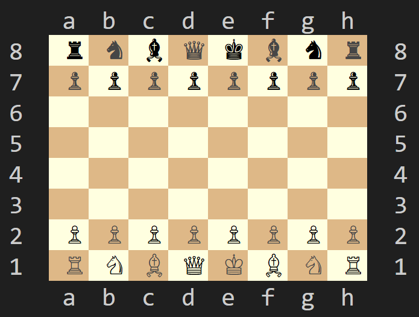
</div><br/>

### 🔀 2.1) Movimenti dei pezzi
***Re***: Può muoversi di una posizione dalla casa in cui si trova in qualsiasi direzione. Purchè non sia sotto scacco o la posizione di arrivo non sia sotto attacco.<br>
<div align="left">  
  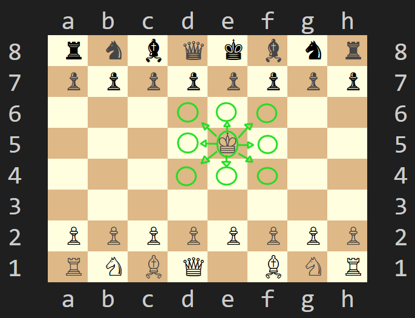
</div><br/>

***Donna***: Può muoversi di un qualsiasi numero di posizioni e in tutte le direzioni.<br>
<div align="left">  
  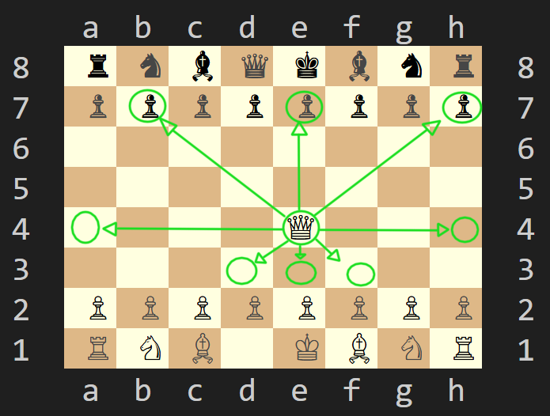
</div><br/>

***Torre***: Può muoversi di un qualsiasi numero di posizioni e solamente in direzione orizzontale o verticale.<br>
<div align="left">  
  
</div><br/>

***Alfiere***: In base alla sua casa di partenza (Bianco o Nero) può muoversi in diagonale di un qualsiasi numero di posizioni rimanendo ovviamente sul suo colore di partenza.<br>
<div align="left">  
  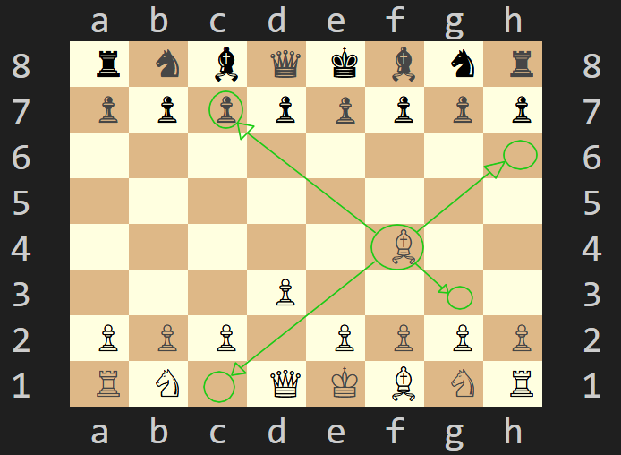
</div><br/>

***Cavallo***: Può muoversi a "L" ovvero può spostarsi di due posizioni in orizzontale o verticale e successivamente di una posizione perpendicolare (movimento ortogonale).<br>

<div align="left">  
  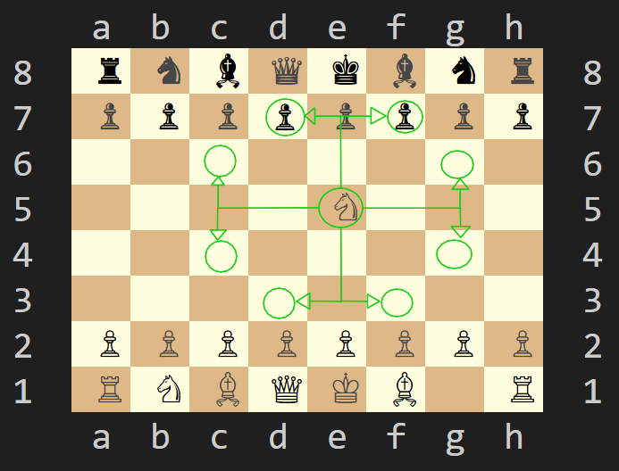
</div><br/>

***Pedone***: Può muoversi avanzando verticalmente di una sola casella, due solamente se è la prima mossa di quel pedone. Il pedone ha la facoltà di catturare solo in diagonale.<br>

<div align="left">
  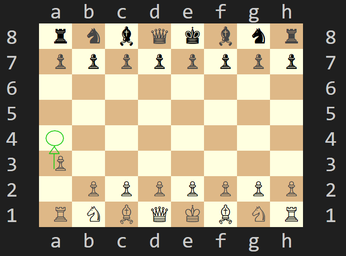
</div><br/>

**<ins>Movimento del Pedone dalla casa di partenza.</ins>**
<div align="left">
  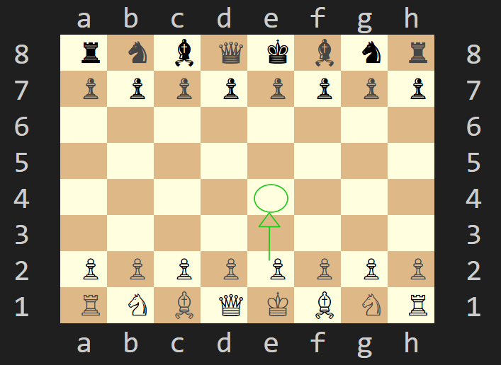
</div><br/>

**<ins>Cattura del Pedone.</ins>**
<div align="left">  
  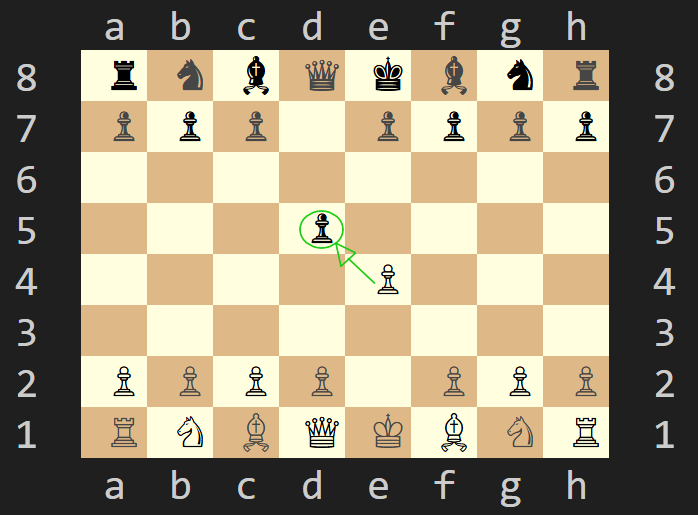
</div><br/>

Il pedone **non può** muoversi all'indietro.
<div align="left">  
  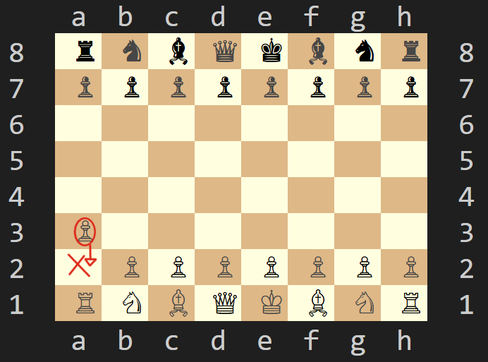
</div><br/>

### 📖 2.2) Regole speciali
#### Arrocco: 
L'arrocco coinvolge il Re e una delle sue due Torri e può essere di due tipi Lungo (0-0-0) o Corto (0-0). L'arrocco si può eseguire solo a determinate condizioni: <br>
Re e Torre **non si sono mai mossi**, le case su cui si muoverà il Re non devono essere occupate, non devono essere sotto attacco e il Re nella sua casa di partenza non deve essere sotto scacco. L'arrocco è una particolare mossa che permette di mettere al sicuro il proprio Re, solo in questo caso il re ha la facoltà di spostarsi di due case e saltare la propria Torre.<br>
<ins>**Arrocco Lungo (0-0-0)**</ins>
<div align="left">  
  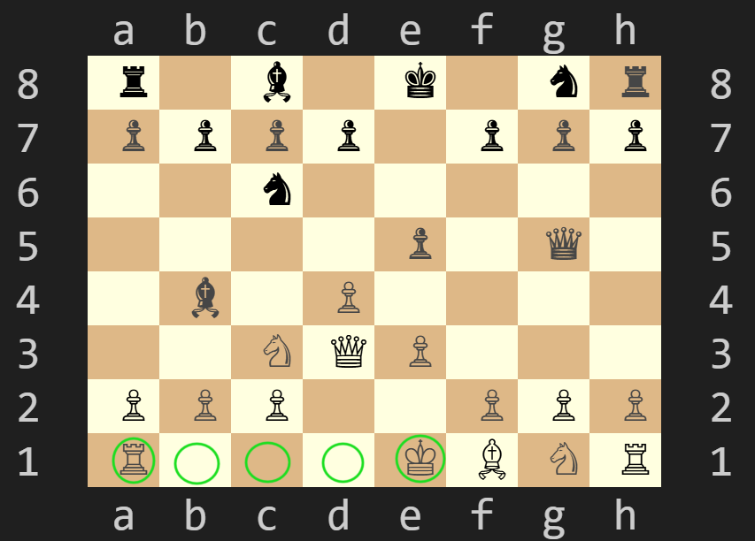
</div><br/>

<div align="left">  
  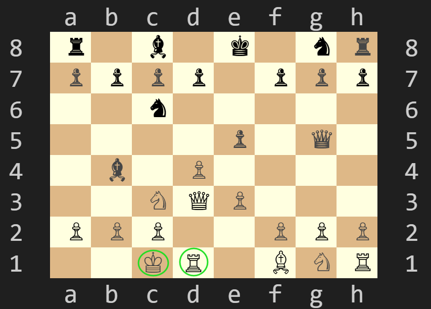
</div><br/>

<ins>**Arrocco corto (0-0)**</ins>
<div align="left">  
  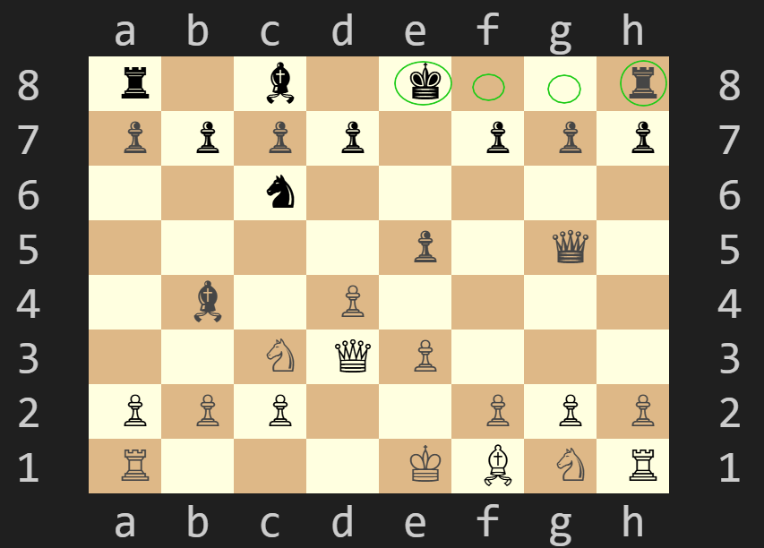
</div><br/>

<div align="left">  
  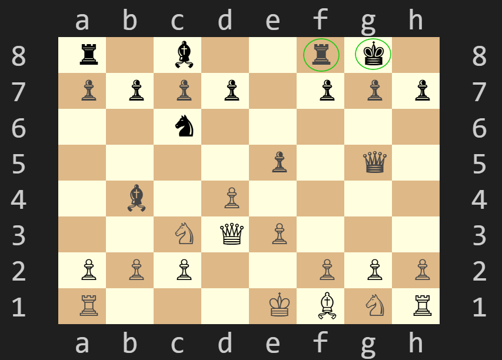
</div><br/>

#### En passant: 
Avviene solo se un pedone avversario avanza di due caselle dalla sua posizione iniziale (cioè dalla seconda alla quarta traversa) e si posiziona accanto a un tuo pedone (nella colonna adiacente). Il pedone può quindi catturarlo come se si fosse mosso di una sola posizione.<br>
<div align="left">  
  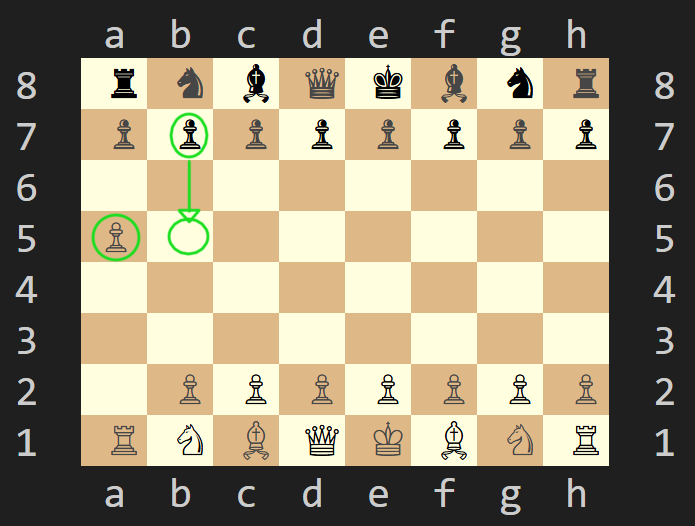
</div><br/>

<div align="left">  
  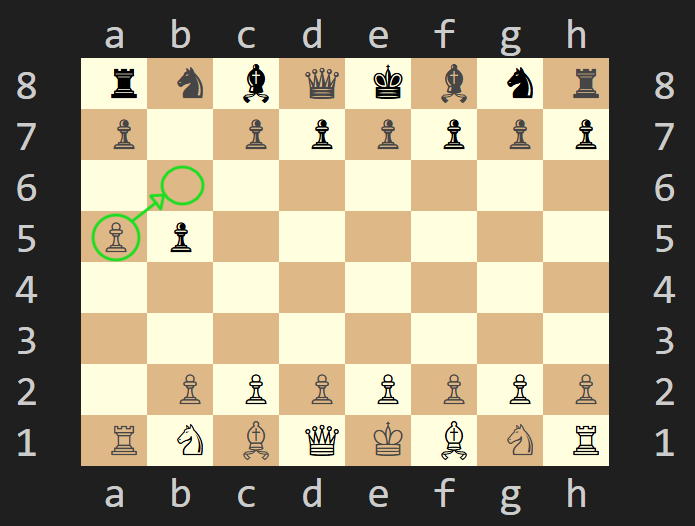
</div><br/>

#### Promozione: 
Quando un pedone raggiunge l'ottava traversa (per il Bianco) o la prima traversa (per il Nero), deve essere promosso (sostituito) a un altro pezzo. La promozione è obbligatoria e avviene immediatamente. I pezzi disponibili alla promozione sono:<br>
Donna (**D**), Torre (**T**), Alfiere (**A**), Cavallo (**C**).
<div align="left">  
  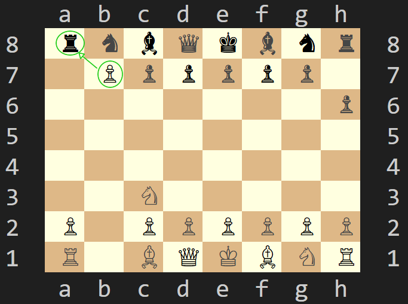
</div><br/>

<div align="left">  
  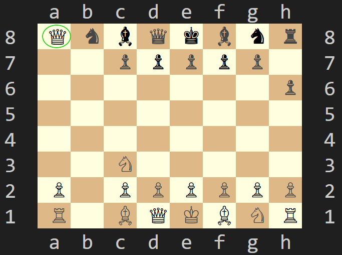
</div><br/>

### 🎯 2.3) Scopo del gioco
L'obiettivo degli **Scacchi** è chiaro: mettere in scacco matto il re avversario, ovvero attaccarlo in una posizione da cui non può più fuggire o essere protetto legalmente. Due giocatori si alternano mossa dopo mossa, per cercare di controllare il centro della scacchiera, sviluppare i propri pezzi e mettere in difficoltà l'avversario.

###  2.4) Notazione algebrica
La notazione algebrica è un sistema di annotazione delle mosse degli scacchi che utilizza le lettere dell'alfabeto per rappresentare i pezzi e le coordinate della scacchiera per indicare le case. In questa applicazione viene utilizzata la notazione algebrica italiana semplificata, che è una versione più compatta.<br>
- **Pezzi**: 
  - Re = R
  - Donna (Regina) = D
  - Torre = T
  - Alfiere = A
  - Cavallo = C
  - Pedone = <ins>nessuna lettera, si indica solo la casa di partenza e quella di arrivo</ins>


- **Case**: Le case della scacchiera sono indicate da una combinazione di lettere e numeri. Le colonne sono indicate dalle lettere da **a** a **h** e le righe sono indicate dai numeri da **1** a **8**. Ad esempio, la casa in basso a sinistra è a1, quella in alto a destra è h8.<br>


- **Mosse**: Le mosse sono indicate dalla lettera del pezzo seguito dalla casa di arrivo (tranne per il pedone). Ad esempio, se un Cavallo si sposta da g1 a f3, la notazione sarà **Cf3**. Se un pedone si sposta da e2 a e4, la notazione sarà: **e4**.
<br/>

- **Arrocco**: L'arrocco corto è indicato con **0-0** e l'arrocco lungo con **0-0-0**.
<br/>

- **Scacco**: Lo scacco è indicato con un segno di più (+) dopo la casa di arrivo del pezzo. Ad esempio, se una Donna si sposta in e5 e mette il Re avversario in scacco, la notazione sarà: **De5+** (<ins>***Il `+` viene inserito automaticamente dall'applicazione il giocatore dovrà esclusivamente dichiarare la mossa De5***</ins>).
<br/>

- **Scacco matto**: Lo scacco matto è indicato con un segno di cancelletto (#) dopo la casa di arrivo del pezzo. Ad esempio, se un Alfiere si sposta in c4 e dà scacco matto al Re avversario, la notazione sarà: **Ac4#** (<ins>***Il `#` viene inserito automaticamente dall'applicazione il giocatore dovrà esclusivamente dichiarare la mossa Ac4***</ins>).
<br/>

- **Cattura**: La cattura è indicata con una "x" tra il pezzo e la casa di arrivo. Ad esempio, se un Alfiere cattura un pezzo in c4, la notazione sarà: **Axc4**.
 Nel caso in cui si tenti di eseguire una cattura senza inserire la x l'applicazione restituirà un messaggio di errore. Per quanto riguarda la cattura del pedone va specificata prima la colonna di partenza e dopo la x la colonna e la riga di arrivo. Ad esempio se un Pedone in b4 cattura un pezzo in c5, la notazione sarà: **bxc5**.
<br/>

- **Promozione**: La promozione di un pedone è indicata apponendo alla fine della mossa il pezzo con cui si promuove. Ad esempio, se un pedone si promuove a Donna in e8, la notazione sarà: **e8D**.
<br/>

- **Mossa ambigua**: Se due pezzi dello stesso tipo possono muoversi o catturare nella stessa casa, si deve specificare la colonna o la riga di partenza del pezzo. Ad esempio, se abbiamo un Cavallo in c3 e uno in g1 e possono entrambi muoversi in e2, la notazione sarà: **Cce2/C3e2** o **Cge2/C1e2**.

<div align="center">  
  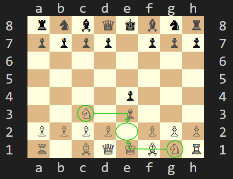
</div><br/>

Nel caso in cui due pezzi dello stesso tipo si trovino nella stessa riga e possano muoversi o catturare nella stessa casa, si deve specificare la colonna di partenza del pezzo, viceversa, nel caso in cui si trovino sulla stessa colonna va specificata la riga. Ad esempio, se abbiamo un Cavallo in c3 e uno in g3 e possono entrambi muoversi o catturare in e4, la notazione sarà **Cce4/Ccxe4** oppure **Cgc4/Cgxc4**.

<div align="center">  
  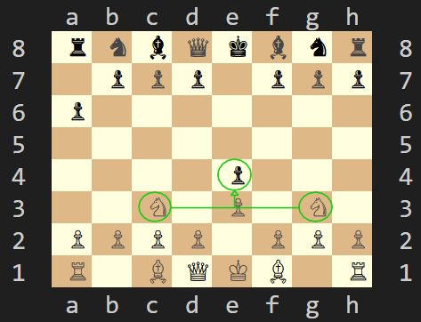
</div><br/>

### 🏆 2.5) Esiti della partita
La partita termina quando uno dei due re viene messo in **scacco matto**.

<div align="center">  
  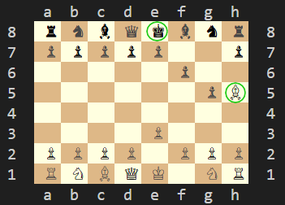
</div><br/>

<div align="center">  
  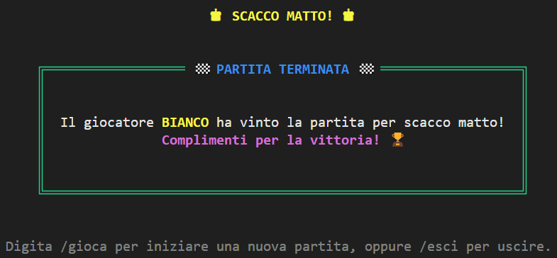
</div><br/>

Tuttavia, il gioco può anche finire in patta, stallo, abbandono o per mancanza di pezzi.
<br>

- ***Patta:*** Un giocatore può offrire *patta* all’avversario **<ins>all'inizio del proprio turno</ins>**. Se il giocatore avversario accetta, la partita termina in parità.
<br>

- ***Stallo:*** Il giocatore di turno non è sotto scacco ma non ha a disposizione mosse legali da poter effettuare, la partita termina automaticamente in parità.
<br>

- ***Abbandono:*** Un giocatore durante <ins>il proprio turno</ins> decide volontariamente di rinunciare alla partita ritirandosi, riconoscendo la propria sconfitta. Al giocatore avversario viene riconosciuta la vittoria della partita.
<br>

- ***Mancanza di Pezzi:*** La partita può terminare automaticamente in parità (patta) se nessuno dei due giocatori dispone più del materiale sufficiente per dare scacco matto. I casi in cui avviene questa condizione sono: <br>
**Re vs Re**, **Re + Cavallo vs Re**, **Re + Alfiere vs Re**, **Re + Alfiere vs Re + Alfiere** (solo se entrambi gli alfieri si trovano su case dello stesso colore).


Per arrivare alla vittoria servono visione strategica, pianificazione accurata e la capacità di anticipare le intenzioni dell'avversario. Ogni mossa conta, e un singolo errore può cambiare le sorti dell'intera partita.


## *3) Procedura preliminare*
Prima di poter avviare il gioco bisogna essere sicuri di trovarsi in un ambiente che permette la
sua esecuzione, per questo lasciamo una guida completa di tutti i passaggi preparatori:

- Come prima cosa bisogna installare l'applicazione [Docker Desktop](https://www.docker.com/products/docker-desktop/) e verificarne la corretta installazione
- Autenticarsi su Docker con github access token tramite CLI come segue:

### 3.1) Creazione Token per il Docker login


Verificare di utilizzare uno dei terminali supportati, riportati nel file Report alla voce Requisiti Non Funzionali

Per ottenere un token per l'accesso alle risorse di GitHub, segui i passaggi descritti di seguito:

1. **Registrazione**: Se non hai già un account, [registrati su GitHub](https://github.com/join) per ottenere un account.

2. **Accesso**: Accedi al tuo account GitHub utilizzando le tue [credenziali di accesso](https://github.com/login).


3. **Generazione del token**: Una volta effettuato l'accesso, vai alle impostazioni del tuo account. Puoi accedervi cliccando sulla tua immagine del profilo e selezionando `Settings`.
   Nella sezione `Developer settings`, seleziona `Personal access tokens` dal menu a sinistra.


4. **Generazione**: Fai clic sul pulsante `Generate new token`


5. **Autorizzazioni**: Seleziona le autorizzazioni necessarie per il token.


6. **Copia il token**: Una volta generato, copia il token. GitHub mostrerà il token solo una volta, quindi assicurati di copiarlo e conservarlo in un luogo sicuro.

A questo punto si è pronti per accedere a Docker tramite Github PAT

### 3.2) Docker Login con GitHub Access Token

1. **Copia del token su un file `.txt`**:

   Copia il token generato in precedenza in un file di testo, ad esempio, `token.txt`


2. **Ottenere il percorso del file**:

   Dopo aver creato il file, copia il percorso completo


3. **Login a GitHub Container Registry (GHCR) tramite Docker**:

   Apri il terminale come amministratore ed esegui il seguente comando, sostituendo `PATH_DEL_TOKEN` con il percorso copiato e `USERNAME` con il tuo nome utente GitHub:

```bash
cat "PATH_DEL_TOKEN/token.txt" | docker login ghcr.io -u "USERNAME" --password-stdin
```
4. **Scaricare l'immagine tramite Docker Pull**:

   Una volta effettuato l'accesso con successo, puoi scaricare l'immagine Docker desiderata con il seguente comando:

```shell
docker pull ghcr.io/softeng2425-inf-uniba/scacchi-naur:latest
```
5. **Esecuzione del container Docker**:
   Una volta eseguito l'accesso e scaricata l'immagine con successo, puoi eseguire l'immagine Docker desiderata con
   il seguente comando:
```shell
docker run --rm -it ghcr.io/softeng2425-inf-uniba/scacchi-naur:latest
```
Questo comando avvierà il gioco **Scacchi**
## *4) Avvio applicazione*
Si consiglia per una corretta visualizzazione della scacchiera di utilizzare il terminale di visual studio code. In caso contrario l'applicazione sarà completamente funzionante, però la scacchiera potrebbe non essere visualizzata correttamente.
<br>
- Per avviare l'applicazione direttamente da terminale, dopo aver installato l'estensione di [Docker](https://marketplace.visualstudio.com/items?itemName=ms-azuretools.vscode-docker) per VS code, è possibile utilizzare il comando:

```shell
docker run --rm -it ghcr.io/softeng2425-inf-uniba/scacchi-naur:latest
```
<br>
All'avvio dell'applicazione viene mostrato in grande il titolo "**SCACCHI**" insieme a dei messaggi di benvenuto. 

<div align="center">  
  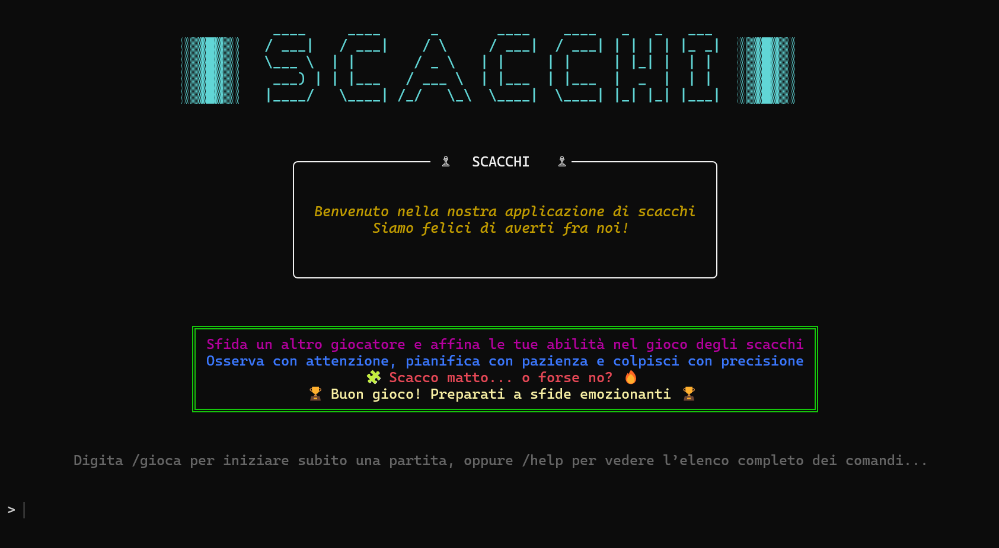
</div><br/>

Viene successivamente invitato l'utente a premere un qualsiasi tasto per continuare.
Se l'applicazione viene avviata insieme ai flag `-h` o `--help` viene mostrato prima della schermata di benevenuto l'elenco dei comandi:
riassuntivo se il flag inserito è `-h`, esteso se il flag inserito è `--help`.

## *5) Guida ai comandi*
Per utilizzare il gioco degli **Scacchi**, seguite le istruzioni riportate di seguito in base al tipo di esecuzione desiderata. Per eseguire un qualsiasi comando tra quelli disponibile utilizzare sempre prima `/`.

### 5.1) Help
Il comando `/help` mostra la guida di base del gioco degli **Scacchi**, Permette di consultare una rapida guida su come muovere i pezzi, il formato delle mosse e tutti i comandi disponibili nel gioco.

<div align="left">  
  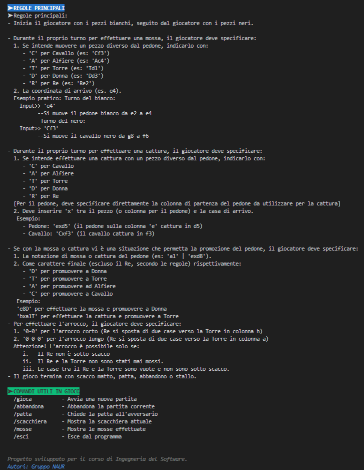
</div><br/>

### 5.2) Gioca
Tramite comando `/gioca` la partita viene avviata e viene mostrata a schermo la scacchiera nella sua configurazione iniziale e l'applicazione resta in attesa di una mossa o del comando sucessivo.

<div align="left">  
  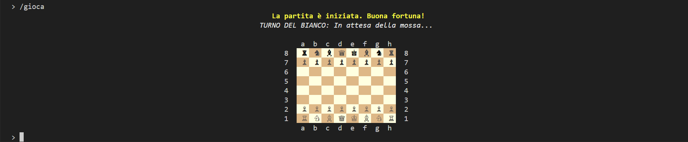
</div><br/>

### 5.3) Scacchiera
Tramite comando `/scacchiera` viene mostrata a schermo la scacchiera con le posizioni attuali dei pezzi.

<div align="left">  
  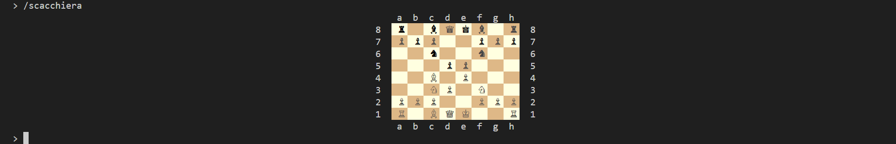
</div><br/>

### 5.4) Mosse
Tramite comando `/mosse` viene mostrato (in notazione algebrica italiana semplificata) lo storico di tutte le mosse effettuate.

<div align="left">  
  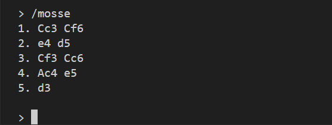
</div><br/>

### 5.5) Abbandona
Tramite comando `/abbandona` viene chiesto all'utente la conferma di abbandono e in caso affermativo la partita viene terminata. In caso contrario la partita prosegue.
Se si utilizza il comando `/abbandona` a partita non avviata verrà mostrato messaggio di errore.

<div align="left">  
  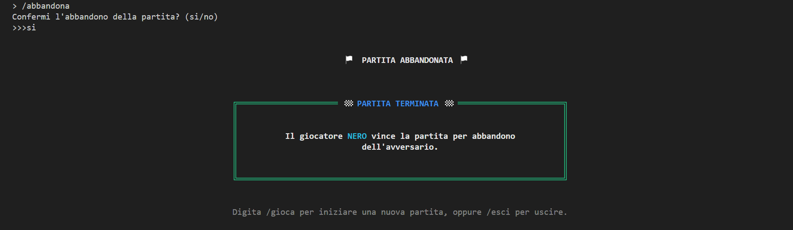
</div><br/>

**<ins>messaggio di errore</ins>**

<div align="left">  
  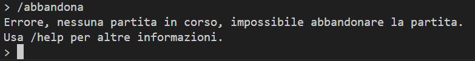
</div><br/>

### 5.6) Patta
Tramite comando `/patta` viene chiesto all'utente la conferma di richiesta della patta e in caso affermativo viene richiesto all'altro giocatore di accettare o rifiutare la patta. In caso affermativo la partita termina in **patta** in caso contrario la partita prosegue.
Se si utilizza il comando `/patta` a partita non avviata verrà mostrato messaggio di errore.

<div align="left">  
  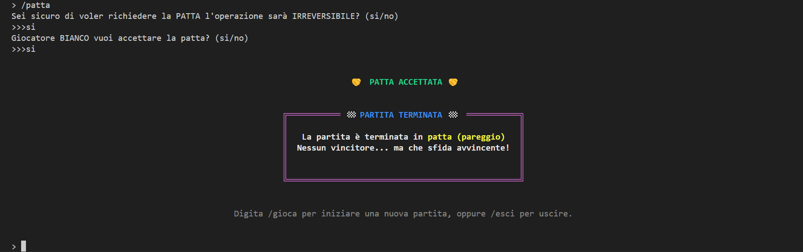
</div><br/>

**<ins>messaggio di errore</ins>**
<div align="left">  
  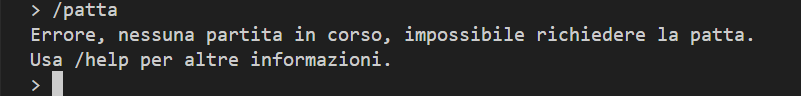
</div><br/>

### 5.7) Esci
Tramite comando `/esci` viene chiesto all'utente la conferma di chiusura dell'applicazione e in caso affermativo l'applicazione viene terminata restituendo il potere al sistema operativo. In caso contrario si può continuare a utilizzare l'applicazione.

<div align="left">  
  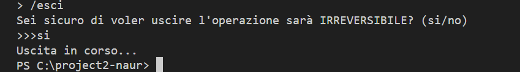
</div><br/>

<div align="left">  
  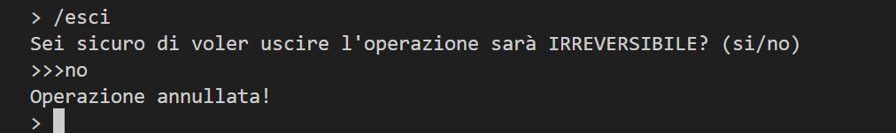
</div><br/>
