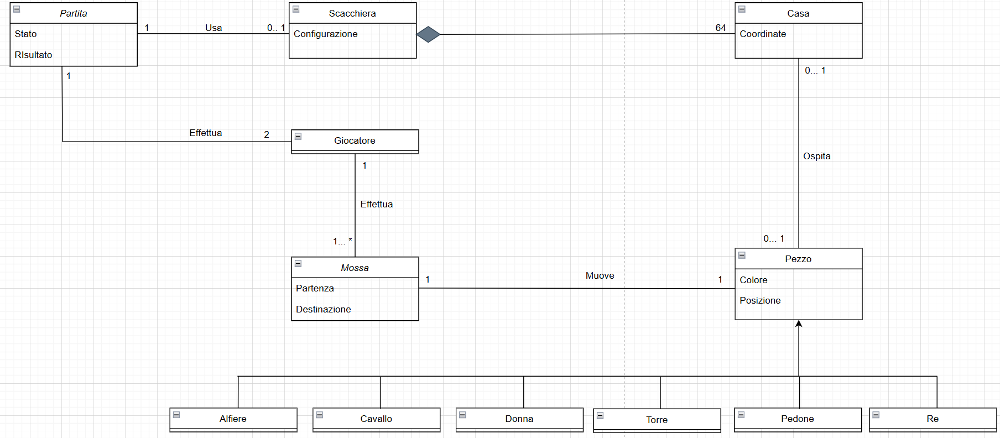
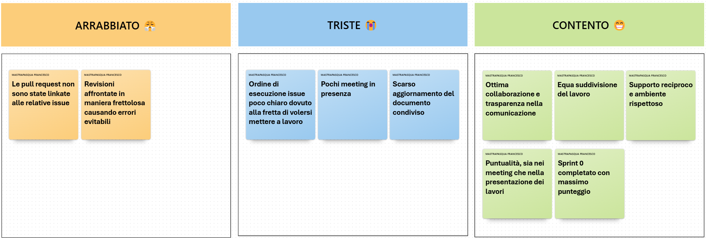

# Indice

<b>
  
1. [Introduzione](#1-introduzione)  
   &nbsp;1.1 [Presentazione del progetto](#11-presentazione-del-progetto)  
   &nbsp;1.2 [Componenti del team](#12-componenti-del-team)  
2. [Modello di dominio](#2-modello-di-dominio)  
3. [Requisiti specifici](#3-requisiti-specifici)  
   &nbsp;3.1 [Requisiti funzionali](#31-requisiti-funzionali)  
   &nbsp;3.2 [Requisiti non funzionali](#32-requisiti-non-funzionali)

<!-- interrompo l’elenco precedente -->
   
8. [Analisi retrospettiva](#8-analisi-retrospettiva)  
   &nbsp;8.1 [Sprint 0](#81-sprint-0)  
       &nbsp;&emsp;&nbsp; 8.1.1 [Arrabbiato, Triste, Contento](#811-arrabbiato-triste-contento)  
       &nbsp;&emsp;&nbsp; 8.1.2 [Stop, Continua](#812-stop-continua)  
       &nbsp;&emsp;&nbsp; 8.1.3 [Azioni da intraprendere](#813-azioni-da-intraprendere)  
       &nbsp;&emsp;&nbsp; 8.1.4 [Conclusione](#814-conclusione)

</b>   

  
# 1. Introduzione

## 1.1 Presentazione del progetto

Il presente documento costituisce la ***relazione tecnica*** del progetto "*Scacchi*", sviluppato nell'ambito del corso di Ingegneria del Software presso l'Università degli Studi Aldo Moro di Bari.

Il progetto ha come obiettivo lo sviluppo di un'implementazione del gioco degli scacchi con *interfaccia a riga di comando* (***CLI***). L'applicazione consente a due giocatori di sfidarsi sulla stessa postazione, alternandosi nelle mosse. Questa relazione documenta in dettaglio il processo di sviluppo adottato, le scelte architetturali e implementative  
effettuate e i risultati conseguiti durante le fasi di realizzazione del sistema.

 

## 1.2 Componenti del team
Il team di sviluppo Naur è composto da:  
• **Arcangelo** ([Areeex](https://github.com/Areeex))  
• **Domenico** ([Rock3toon](https://github.com/Rock3toon))  
• **Fabio** ([FabioPSTELL](https://github.com/FabioPSTELL))  
• **Francesco** ([frenk437](https://github.com/frenk437))  
• **Lorenzo** ([lorenzoPeluso04](https://github.com/lorenzoPeluso04))  
• **Pio** ([PrinceH4k](https://github.com/PrinceH4k))  
Sotto la supervisione del Prof. Filippo Lanubile
  

# 2. Modello di dominio

  
Il ***modello di dominio*** rappresenta visualmente i concetti principali del dominio degli scacchi e le associazioni che intercorrono fra di essi. Nel nostro caso i concetti individuati sono:
- **Partita**: Questo concetto rappresenta una sessione di gioco tra due giocatori. Ha come attributi principali lo <ins>*stato*</ins> (ad esempio: in corso, terminata) e il <ins>*risultato*</ins> (vittoria, patta, ecc.).   
- **Scacchiera**: Questo concetto rappresenta la scacchiera ossia l'insieme strutturato delle case che compongono il campo di gioco. Ha come attributo <ins>*configurazione*</ins> , che rappresenta la disposizione iniziale o attuale dei pezzi.   
- **Casa**: Questo concetto rappresenta una singola posizione sulla scacchiera, identificata dalle <ins>*coordinate*</ins> (ad esempio E4, H7, ecc.).    
- **Pezzo**: Questo concetto rappresenta ciascun pezzo degli scacchi. Ogni pezzo è caratterizzato da due attributi: il <ins>*colore*</ins> (bianco o nero) e la <ins>*posizione*</ins> attuale sulla scacchiera. I pezzi sono specializzati in sei tipi: *Re*, *Donna*, *Torre*, *Alfiere*, *Cavallo*, *Pedone*.   
- **Giocatore**: Questo concetto rappresenta i due giocatori effettuano la partita.   
- **Input**: Questo concetto rappresenta un’azione digitata dal giocatore, che può essere una ***mossa*** (con indicazione di <ins>*partenza*</ins> e <ins>*destinazione*</ins>) oppure un ***comando*** (es. abbandono, proposta di patta).   

Il modello è stato rappresentato attraverso un **diagramma delle classi con prospettiva concettuale** che illustra chiaramente le entità, gli attributi e le relazioni del sistema.

  
  

 

 

# 3. Requisiti specifici

  
I ***requisiti specifici*** definiscono l'elenco dettagliato delle condizioni e delle aspettative che il sistema deve rispettare. Vengono distinti in *requisiti funzionali* e *requisiti non funzionali*.

 

  
## 3.1 Requisiti funzionali

  
I ***requisiti funzionali*** rappresentano le aspettative o le condizioni sulle funzioni che il sistema deve svolgere e descrivono ciò che il sistema deve fare per soddisfare i bisogni dei committenti o degli utenti. 

Si è scelto di utilizzare lo stile di **descrizione di caso d’uso mediante scenari**: questo stile descrive la funzionalità dal punto di vista dell'attore che interagisce con il sistema, come un dialogo o una narrazione strutturata delle interazioni. Di seguito sono elencati e descritti i principali requisiti funzionali della nostra applicazione.

  
### RF1 – Come giocatore voglio mostrare l'help con elenco comandi
**Codice caso d’uso**: UC01  
**Nome**: Mostrare l’help con l’elenco comandi  
**Attori**: Giocatore  
**Obiettivo**: il sistema mostra una breve descrizione dell’app, seguita dalla lista dei comandi disponibili, uno per riga 
<ins>**Pre-condizioni**</ins> :   
Per utilizzare il comando `/help` l’applicazione deve essere avviata. Per usare i flag `--help` o `-h` bisogna inserirli quando si invoca il comando per aprire l’app.  
<ins>**Post-condizioni**</ins>:  
L’applicazione resta in attesa di un nuovo comando.  

**Scenario 1**:  
1. Il giocatore digita il comando `/help`  
2. Il sistema fornisce un elenco comandi con una descrizione per ognuno e attende un input del giocatore 

**Scenario 2**:  
1. Il giocatore all’avvio dell’applicazione inserisce un flag per visualizzare l’elenco comandi  
2. Il sistema fornisce un elenco comandi:  
2a. Dettagliato se il flag inserito è `--help`  
2b. Compatto se il flag inserito è `-h`

### RF2 - Come giocatore voglio iniziare una nuova partita

  
**Codice caso d’uso**: UC02  
**Nome**: Iniziare una nuova partita  
**Attori**: Giocatore  
**Obiettivo**: al comando `/gioca` il sistema inizializza una nuova partita, crea una scacchiera con i pezzi nella posizione di partenza standard e la visualizza; quindi, si predispone a ricevere la prima mossa del Bianco (o un altro comando)  
<ins>**Pre-condizioni**</ins> :   
L’applicazione deve essere avviata. Non deve esserci una partita in corso.  
<ins>**Post-condizioni**</ins> :  
Il sistema avvia una partita e resta in attesa della prima mossa del Bianco o di un altro comando.

**Scenario Base**:  
1. Il giocatore digita il comando `/gioca`  
2. Il sistema stampa una scacchiera con i pezzi nella posizione di inizio e resta in attesa prima mossa o di un altro comando

### RF3 - Come giocatore voglio mostrare la scacchiera con i pezzi

  
**Codice caso d’uso**: UC03  
**Nome**: Mostrare la scacchiera con i pezzi  
**Attori**: Giocatore  
**Obiettivo**: al comando `/scacchiera` il sistema visualizza la posizione attuale di tutti i pezzi nella scacchiera. Se nessuna partita è in corso il sistema suggerisce di usare `/gioca`  
<ins>**Pre-condizioni**</ins> :   
L’applicazione deve essere avviata.  
<ins>**Post-condizioni**</ins> :  
 Il sistema rimane in attesa di un comando o in attesa di una mossa.

**Scenario 1**:  
1. Durante una partita il giocatore digita il comando `/scacchiera`  
2. Il sistema stampa una scacchiera con i pezzi nella loro posizione attuale

**Scenario 2**:  
1. Il giocatore digita il comando `/scacchiera` quando nessuna partita è in corso  
2. Il sistema suggerisce di usare il comando `/gioca` per iniziare una partita

### RF4 - Come giocatore voglio abbandonare la partita

  
**Codice caso d’uso**: UC04  
**Nome**: Abbandonare la partita  
**Attori**: Giocatore  
**Obiettivo**: al comando `/abbandona` il sistema chiede conferma al giocatore che ha richiesto l’abbandono. Se confermata il sistema termina la partita e dichiara l’avversario come vincitore. Se non confermata il sistema mantiene lo stato corrente di gioco e rimane in attesa di input.  
<ins>**Pre-condizioni**</ins> :  
L’applicazione deve essere avviata. Deve esserci una partita in corso.  
<ins>**Post-condizioni**</ins> :  
Il sistema rimane in attesa di un comando o in attesa di una mossa.  

**Scenario 1**:  
1. Durante una partita il giocatore digita il comando `/abbandona`  
2. Il sistema chiede conferma al giocatore che ha richiesto l’operazione  
3. Il giocatore conferma l’operazione  
4. Il sistema dichiara il giocatore avversario come vincitore e termina la partita

**Scenario 2**:  
1. Durante una partita il giocatore digita il comando `/abbandona`  
2. Il sistema chiede conferma al giocatore che ha richiesto l’operazione  
3. Il giocatore non conferma l’operazione  
4. Il sistema avvisa che l’operazione è stata annullata e rimane in attesa di una mossa o di un comando

### RF5 - Come giocatore voglio proporre la patta

  
**Codice caso d’uso**: UC05  
**Nome**: Proporre la patta  
**Attori**: Giocatore, Giocatore avversario  
**Obiettivo**: al comando `/patta` il sistema effettua una richiesta di patta al giocatore avversario. Se confermata il sistema termina la partita come patta (o pareggio). Se non confermata il sistema mantiene lo stato corrente di gioco e rimane in attesa di input.  
<ins>**Pre-condizioni**</ins> :  
L’applicazione deve essere avviata. Deve esserci una partita in corso.  
<ins>**Post-condizioni**</ins> :  
Il sistema rimane in attesa di un comando o in attesa di una mossa.

**Scenario 1**:  
1. Durante una partita il giocatore digita il comando `/patta`  
2. Il sistema effettua una richiesta di patta al giocatore avversario  
3. Il giocatore avversario accetta la richiesta  
4. Il sistema termina la partita come patta

**Scenario 2**:  
1. Durante una partita il giocatore digita il comando `/patta`  
2. Il sistema effettua una richiesta di patta al giocatore avversario  
3. Il giocatore avversario rifiuta la richiesta  
4. Il sistema mantiene lo stato attuale della partita e rimane in attesa di una mossa o di un comando

### RF6 - Come giocatore voglio chiudere il gioco

  
**Codice caso d’uso**: UC06  
**Nome**: Chiudere il gioco  
**Attori**: Giocatore  
**Obiettivo**: al comando `/esci` il sistema chiede conferma al giocatore. Se la conferma è positiva l’applicazione si chiude e restituisce il controllo al sistema operativo mentre se la conferma è negativa l’app rimane in esecuzione e torna in attesa di input  
<ins>**Pre-condizioni**</ins> :  
L’applicazione deve essere avviata.  
<ins>**Post-condizioni**</ins> :  
Se l’operazione è stata confermata viene chiusa l’applicazione mentre se l’operazione è stata annullata il sistema rimane in attesa di un comando o di una mossa.

**Scenario 1**:  
1. Il giocatore digita il comando `/esci`  
2. Il sistema chiede conferma al giocatore che ha richiesto l’operazione  
3. Il giocatore conferma l’operazione  
4. Il sistema termina l’applicazione e viene restituito il controllo al sistema operativo

**Scenario 2**:  
1. Il giocatore digita il comando `/esci`  
2. Il sistema chiede conferma al giocatore che ha richiesto l’operazione  
3. Il giocatore annulla l’operazione  
4. Il sistema mantiene lo stato attuale della partita e rimane in attesa di una mossa o di un comando

### RF7 - Come giocatore voglio muovere un pedone

  
**Codice caso d’uso**: UC07  
**Nome**: Muovere un pedone  
**Attori**: Giocatore  
**Obiettivo**: Il sistema esegue la mossa per spostare un pedone descritta in notazione algebrica dall’utente. Il pedone potrà avanzare di una casella (o di due se è la prima mossa) e non è previsto nessun movimento all’indietro né superamento di pezzo ostacolante.  

> Nota: in questo requisito non è prevista la cattura di un altro pedone.

<ins>**Pre-condizioni**</ins> :  
L’applicazione deve essere avviata. Deve esserci una partita in corso.  
<ins>**Post-condizioni**</ins> :  
Scacchiera aggiornata e attesa di un comando da parte dell’avversario. Se la mossa non è valida viene stampato un messaggio di errore e viene chiesto allo stesso giocatore di inserire una mossa valida.

**Scenario 1**:  
1. Durante una partita il giocatore inserisce una mossa in notazione algebrica  
2. Il sistema aggiorna la scacchiera e passa il turno all’avversario

**Scenario 2**:  
1. Durante una partita il giocatore inserisce una mossa non valida  
2. Il sistema stampa un messaggio di errore e viene chiesto allo stesso giocatore di inserire una mossa valida.

### RF8 - Come giocatore voglio mostrare le mosse giocate

  
**Codice caso d’uso**: UC08  
**Nome**: Mostrare le mosse giocate  
**Attori**: Giocatore  
**Obiettivo**: Al comando `/mosse` il sistema restituisce l’elenco di tutte le mosse effettuate fino a quel momento, numerate e in notazione algebrica. Se nessuna partita è in corso il sistema suggerisce di usare `/gioca`  
<ins>**Pre-condizioni**</ins> :  
L’applicazione deve essere avviata. Deve esserci una partita in corso.  
<ins>**Post-condizioni**</ins> :  
Il sistema rimane in attesa di un comando o in attesa di una mossa.  

**Scenario 1**:  
1. Durante una partita il giocatore digita il comando `/mosse`  
2. Il sistema stampa l’elenco numerato delle mosse eseguite fino a quell’istante

**Scenario 2**:  
1. Il giocatore digita il comando `/mosse` quando nessuna partita è in corso  
2. Il sistema suggerisce di usare il comando `/gioca` per iniziare una partita

 

## 3.2 Requisiti non funzionali

I ***requisiti non funzionali*** rappresentano le aspettative o le condizioni su tutti gli aspetti del sistema che non riguardano le funzioni che deve svolgere. Di seguito sono elencati i principali requisiti non funzionali della nostra applicazione.

  
### RNF1 - Il sistema deve essere eseguito in un container Docker

  
### RNF2 - Il sistema deve supportare i seguenti terminali:
- Terminali Linux  
- Terminali macOS  
- PowerShell di Windows  
- Git Bash su Windows

### RNF3 - Il sistema deve rappresentare i pezzi degli scacchi con relativi simboli UTF-8: ♔ ♕ ♖ ♗ ♘ ♙ ♚ ♛ ♜ ♝♞♟

 

# 8. Analisi retrospettiva

  
In questa sezione valutiamo il nostro modo di lavorare durante lo sviluppo del software verificando il rispetto delle regole definite dal team, dal Code of Conduct al Manifesto Agile. Attraverso l’***analisi di punti di forza e criticità*** emersi, strutturati in tabelle dedicate, identificheremo le aree di miglioramento e proporremo azioni concrete per prevenire gli stessi errori nelle prossime iterazioni.

 

  
## 8.1 Sprint 0

  
### 8.1.1 Arrabbiato, Triste, Contento

  
La retrospettiva dello Sprint 0 si è aperta con una lavagna *Arrabbiato-Triste-Contento*, attraverso la quale ogni membro ha condiviso impressioni e sentimenti relativi alla chiusura di questa prima fase. Questo ci ha permesso di raccogliere feedback immediati e di gettare le basi per il miglioramento continuo.

  

  
  

 

Dalla lavagna si evince che il team è:  
- **Arrabbiato** perché le pull request non sono state linkate alle relative issue e le revisioni sono state affrontate in maniera frettolosa;
- **Triste** perché a causa della fretta di volersi mettere a lavoro non abbiamo stabilito un ordine di esecuzione delle issue rivelatosi poi necessario per alcune issue. Il team vorrebbe anche aumentare i meeting in presenza ed è stato segnalato lo scarso aggiornamento del documento condiviso che utilizziamo per gestire e coordinare questo progetto;
- **Contento** perché grazie ad un’ottima collaborazione, comunicazione efficiente, equa suddivisione del lavoro, rispetto reciproco e puntualità siamo riusciti ad ottenere un buon risultato.

 

  
### 8.1.2 Stop, Continua

La fase successiva ha previsto un’analisi approfondita delle nostre pratiche di lavoro. In particolare, abbiamo segnalato e concordato azioni che non devono assolutamente essere ripetute e allo stesso tempo abbiamo individuato quali attività e processi continuare a mettere in atto.

  
❌ <ins>**STOP**</ins>
- Lasciare issue aperte senza collegamento dalle relative pull request;
- Revisioni superficiali e frettolose.

✅ <ins>**CONTINUA**</ins>
- Comunicazioni efficienti: Proseguiamo a coordinarci e scambiarci aggiornamenti sui canali WhatsApp e Discord;
- Aggiornamento del documento condiviso: Manteniamo viva il google doc condiviso per tenere traccia di tutte le attività svolte;
- Assegnazione task basata sulle user story: Continuiamo a distribuire le attività in relazione alla valutazione in User Point;
- Rispetto del Code of Conduct: L’atmosfera di lavoro rimane inclusiva e rispettosa, come finora.

 

### 8.1.3 Azioni da intraprendere

  
Il risultato del nostro meeting di retrospettiva è stata una **lista di buone pratiche** da intraprendere nelle fasi successive dello sviluppo del progetto:
- ***Organizzare meeting in presenza***: Il team si impegna a predisporre meeting in presenza in maniera tale da rendere la parte di progettazione più efficace e condivisa ed evitare così le interruzioni che potrebbero verificarsi con i meeting online;
- ***Definire un ordine di svolgimento delle issue***: Per evitare collisioni e sovrapposizioni prima dell’assegnazione delle issue bisogna farsi in maniera collettiva un’idea sul come deve essere svolto l’intero Sprint e stabilire una sequenza chiara di svolgimento delle issue;
- ***Riassumere i punti chiavi dei meeting***: A ogni meeting un diverso membro del team deve occuparsi di riassumere i punti chiave e aggiornare la tabella dedicata nel documento condiviso;
- ***Introdurre un tempo minimo di revisione***: Garantire che ogni pull request riceva un’analisi approfondita prima che sia effettuato il merge. Si è deciso di stabilire un tempo minimo di <ins>7 minuti</ins> per revisione.

 

### 8.1.4 Conclusione

  
In conclusione, nonostante qualche piccola criticità emersa lungo il percorso, il team si è mostrato ampiamente soddisfatto dei risultati raggiunti.

Il meeting di retrospettiva ci ha offerto l’occasione di riflettere sulle metodologie adottate durante lo Sprint: dal confronto sono emerse numerose proposte operative, sintetizzate in una vera e propria lista di buone pratiche. Questi spunti saranno messi in atto per ottimizzare il nostro flusso di lavoro e migliorare costantemente la qualità del progetto.

