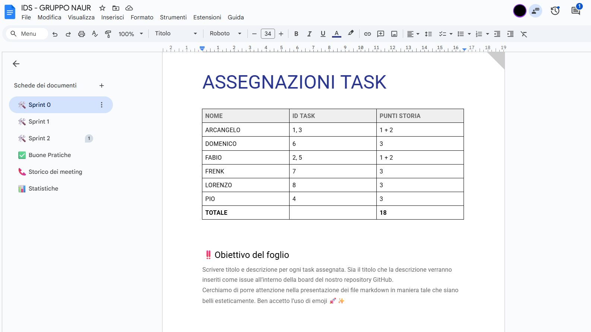

# Indice

<b>
  
1. [Introduzione](#1-introduzione)  
    1.1 [Presentazione del progetto](#11-presentazione-del-progetto)  
    1.2 [Componenti del team](#12-componenti-del-team)  
2. [Modello di dominio](#2-modello-di-dominio)  
3. [Requisiti specifici](#3-requisiti-specifici)  
    3.1 [Requisiti funzionali Sprint 1](#31-requisiti-funzionali-sprint-1)  
    3.2 [Requisiti funzionali Sprint 2](#32-requisiti-funzionali-sprint-2)  
    3.3 [Requisiti non funzionali](#33-requisiti-non-funzionali)  
4. [System Design](#4-system-design)  
    4.1 [Diagramma dei pacchetti](#41-diagramma-dei-pacchetti)  
    4.2 [Architettura dell’applicazione](#42-architettura-dellapplicazione)  
    4.3 [Commenti sulle decisioni](#43-commenti-sulle-decisioni)  
5. [Object Oriented Design](#5-object-oriented-design)  
    5.1 [Diagrammi di Classi e Sequenza](#51-diagrammi-di-classi-e-sequenza)  
6. [Riepilogo dei Test](#6-riepilogo-dei-test)  
    6.1 [Strumenti di analisi/testing del codice utilizzati](#61-strumenti-di-analisitesting-del-codice-utilizzati)  
    6.2 [Presentazione della fase di testing](#62-presentazione-della-fase-di-testing)  
    6.3 [Descrizione dei test effettuati](#63-descrizione-dei-test-effettuati)  
7. [Processo di Sviluppo e Organizzazione del lavoro](#7-processo-di-sviluppo-e-organizzazione-del-lavoro)  
    7.1 [Introduzione al processo di sviluppo](#71-introduzione-al-processo-di-sviluppo)  
    7.2 [Milestone e Project Board](#72-milestone-e-project-board)  
    7.3 [GitHub Flow](#73-github-flow)  
    7.4 [Roadmap degli Sprint](#74-roadmap-degli-sprint)  
    7.5 [Gestione degli Sprint](#75-gestione-degli-sprint)  
        7.5.1 [Sprint 0](#751-sprint-0)  
        7.5.2 [Sprint 1](#752-sprint-1)  
        7.5.3 [Sprint 2](#753-sprint-2)  
    7.6 [Software utilizzati](#76-software-utilizzati)  
    7.7 [Comunicazione interna](#77-comunicazione-interna)  
8. [Analisi retrospettiva](#8-analisi-retrospettiva)  
    8.1 [Sprint 0](#81-sprint-0)  
        8.1.1 [Arrabbiato, Triste, Contento](#811-arrabbiato-triste-contento)  
        8.1.2 [Stop, Continua](#812-stop-continua)  
        8.1.3 [Azioni da intraprendere](#813-azioni-da-intraprendere)  
        8.1.4 [Conclusione](#814-conclusione)  
    8.2 [Sprint 1](#82-sprint-1)  
        8.2.1 [Arrabbiato, Triste, Contento](#821-arrabbiato-triste-contento)  
        8.2.2 [Stop, Continua](#822-stop-continua)  
        8.2.3 [Azioni da intraprendere](#823-azioni-da-intraprendere)  
        8.2.4 [Conclusione](#824-conclusione)

</b>   

</b>   

  
# 1. Introduzione

## 1.1 Presentazione del progetto

Il presente documento costituisce la ***relazione tecnica*** del progetto "*Scacchi*", sviluppato nell'ambito del corso di Ingegneria del Software presso l'Università degli Studi Aldo Moro di Bari.

Il progetto ha come obiettivo lo sviluppo di un'implementazione del gioco degli scacchi con *interfaccia a riga di comando* (***CLI***). L'applicazione consente a due giocatori di sfidarsi sulla stessa postazione, alternandosi nelle mosse. Questa relazione documenta in dettaglio il processo di sviluppo adottato, le scelte architetturali e implementative  
effettuate e i risultati conseguiti durante le fasi di realizzazione del sistema.

 

## 1.2 Componenti del team
Il team di sviluppo Naur è composto da:  
• **Arcangelo** ([Areeex](https://github.com/Areeex))  
• **Domenico** ([Rock3toon](https://github.com/Rock3toon))  
• **Fabio** ([FabioPSTELL](https://github.com/FabioPSTELL))  
• **Francesco** ([frenk437](https://github.com/frenk437))  
• **Lorenzo** ([lorenzoPeluso04](https://github.com/lorenzoPeluso04))  
• **Pio** ([PrinceH4k](https://github.com/PrinceH4k))  
Sotto la supervisione del Prof. Filippo Lanubile
  

# 2. Modello di dominio

  
Il ***modello di dominio*** rappresenta visualmente i concetti principali del dominio degli scacchi e le associazioni che intercorrono fra di essi. Nel nostro caso i concetti individuati sono:
- **Partita**: Questo concetto rappresenta una sessione di gioco tra due giocatori. Ha come attributi principali lo <ins>*stato*</ins> (ad esempio: in corso, terminata) e il <ins>*risultato*</ins> (vittoria, patta, ecc.).   
- **Scacchiera**: Questo concetto rappresenta la scacchiera ossia l'insieme strutturato delle case che compongono il campo di gioco. Ha come attributo <ins>*configurazione*</ins> , che rappresenta la disposizione iniziale o attuale dei pezzi.   
- **Casa**: Questo concetto rappresenta una singola posizione sulla scacchiera, identificata dalle <ins>*coordinate*</ins> (ad esempio E4, H7, ecc.).    
- **Pezzo**: Questo concetto rappresenta ciascun pezzo degli scacchi. Ogni pezzo è caratterizzato da due attributi: il <ins>*colore*</ins> (bianco o nero) e la <ins>*posizione*</ins> attuale sulla scacchiera. I pezzi sono specializzati in sei tipi: *Re*, *Donna*, *Torre*, *Alfiere*, *Cavallo*, *Pedone*.   
- **Giocatore**: Questo concetto rappresenta i due giocatori effettuano la partita.   

Il modello è stato rappresentato attraverso un **diagramma delle classi con prospettiva concettuale** che illustra chiaramente le entità, gli attributi e le relazioni del sistema.

  
  

 

 

# 3. Requisiti specifici

  
I ***requisiti specifici*** definiscono l'elenco dettagliato delle condizioni e delle aspettative che il sistema deve rispettare. Vengono distinti in *requisiti funzionali* e *requisiti non funzionali*.

 

  
## 3.1 Requisiti funzionali Sprint 1

  
I ***requisiti funzionali*** rappresentano le aspettative o le condizioni sulle funzioni che il sistema deve svolgere e descrivono ciò che il sistema deve fare per soddisfare i bisogni dei committenti o degli utenti. 

Si è scelto di utilizzare lo stile di **descrizione di caso d’uso mediante scenari**: questo stile descrive la funzionalità dal punto di vista dell'attore che interagisce con il sistema, come un dialogo o una narrazione strutturata delle interazioni. Di seguito sono elencati e descritti i principali requisiti funzionali della nostra applicazione.

  
### RF1 – Come giocatore voglio mostrare l'help con elenco comandi
**Codice caso d’uso**: UC01  
**Nome**: Mostrare l’help con l’elenco comandi  
**Attori**: Giocatore  
**Obiettivo**: il sistema mostra una breve descrizione dell’app, seguita dalla lista dei comandi disponibili, uno per riga 
<ins>**Pre-condizioni**</ins> :   
Per utilizzare il comando `/help` l’applicazione deve essere avviata. Per usare i flag `--help` o `-h` bisogna inserirli quando si invoca il comando per aprire l’app.  
<ins>**Post-condizioni**</ins>:  
L’applicazione resta in attesa di un nuovo comando.  

**Scenario 1**:  
1. Il giocatore digita il comando `/help`  
2. Il sistema fornisce un elenco comandi con una descrizione per ognuno e attende un input del giocatore 

**Scenario 2**:  
1. Il giocatore all’avvio dell’applicazione inserisce un flag per visualizzare l’elenco comandi  
2. Il sistema fornisce un elenco comandi:  
2a. Dettagliato se il flag inserito è `--help`  
2b. Compatto se il flag inserito è `-h`

### RF2 - Come giocatore voglio iniziare una nuova partita

  
**Codice caso d’uso**: UC02  
**Nome**: Iniziare una nuova partita  
**Attori**: Giocatore  
**Obiettivo**: al comando `/gioca` il sistema inizializza una nuova partita, crea una scacchiera con i pezzi nella posizione di partenza standard e la visualizza; quindi, si predispone a ricevere la prima mossa del Bianco (o un altro comando)  
<ins>**Pre-condizioni**</ins> :   
L’applicazione deve essere avviata. Non deve esserci una partita in corso.  
<ins>**Post-condizioni**</ins> :  
Il sistema avvia una partita e resta in attesa della prima mossa del Bianco o di un altro comando.

**Scenario Base**:  
1. Il giocatore digita il comando `/gioca`  
2. Il sistema stampa una scacchiera con i pezzi nella posizione di inizio e resta in attesa prima mossa o di un altro comando

### RF3 - Come giocatore voglio mostrare la scacchiera con i pezzi

  
**Codice caso d’uso**: UC03  
**Nome**: Mostrare la scacchiera con i pezzi  
**Attori**: Giocatore  
**Obiettivo**: al comando `/scacchiera` il sistema visualizza la posizione attuale di tutti i pezzi nella scacchiera. Se nessuna partita è in corso il sistema suggerisce di usare `/gioca`  
<ins>**Pre-condizioni**</ins> :   
L’applicazione deve essere avviata.  
<ins>**Post-condizioni**</ins> :  
 Il sistema rimane in attesa di un comando o in attesa di una mossa.

**Scenario 1**:  
1. Durante una partita il giocatore digita il comando `/scacchiera`  
2. Il sistema stampa una scacchiera con i pezzi nella loro posizione attuale

**Scenario 2**:  
1. Il giocatore digita il comando `/scacchiera` quando nessuna partita è in corso  
2. Il sistema suggerisce di usare il comando `/gioca` per iniziare una partita

### RF4 - Come giocatore voglio abbandonare la partita

  
**Codice caso d’uso**: UC04  
**Nome**: Abbandonare la partita  
**Attori**: Giocatore  
**Obiettivo**: al comando `/abbandona` il sistema chiede conferma al giocatore che ha richiesto l’abbandono. Se confermata il sistema termina la partita e dichiara l’avversario come vincitore. Se non confermata il sistema mantiene lo stato corrente di gioco e rimane in attesa di input.  
<ins>**Pre-condizioni**</ins> :  
L’applicazione deve essere avviata. Deve esserci una partita in corso.  
<ins>**Post-condizioni**</ins> :  
Il sistema rimane in attesa di un comando o in attesa di una mossa.  

**Scenario 1**:  
1. Durante una partita il giocatore digita il comando `/abbandona`  
2. Il sistema chiede conferma al giocatore che ha richiesto l’operazione  
3. Il giocatore conferma l’operazione  
4. Il sistema dichiara il giocatore avversario come vincitore e termina la partita

**Scenario 2**:  
1. Durante una partita il giocatore digita il comando `/abbandona`  
2. Il sistema chiede conferma al giocatore che ha richiesto l’operazione  
3. Il giocatore non conferma l’operazione  
4. Il sistema avvisa che l’operazione è stata annullata e rimane in attesa di una mossa o di un comando

### RF5 - Come giocatore voglio proporre la patta

  
**Codice caso d’uso**: UC05  
**Nome**: Proporre la patta  
**Attori**: Giocatore, Giocatore avversario  
**Obiettivo**: al comando `/patta` il sistema effettua una richiesta di patta al giocatore avversario. Se confermata il sistema termina la partita come patta (o pareggio). Se non confermata il sistema mantiene lo stato corrente di gioco e rimane in attesa di input.  
<ins>**Pre-condizioni**</ins> :  
L’applicazione deve essere avviata. Deve esserci una partita in corso.  
<ins>**Post-condizioni**</ins> :  
Il sistema rimane in attesa di un comando o in attesa di una mossa.

**Scenario 1**:  
1. Durante una partita il giocatore digita il comando `/patta`  
2. Il sistema effettua una richiesta di patta al giocatore avversario  
3. Il giocatore avversario accetta la richiesta  
4. Il sistema termina la partita come patta

**Scenario 2**:  
1. Durante una partita il giocatore digita il comando `/patta`  
2. Il sistema effettua una richiesta di patta al giocatore avversario  
3. Il giocatore avversario rifiuta la richiesta  
4. Il sistema mantiene lo stato attuale della partita e rimane in attesa di una mossa o di un comando

### RF6 - Come giocatore voglio chiudere il gioco

  
**Codice caso d’uso**: UC06  
**Nome**: Chiudere il gioco  
**Attori**: Giocatore  
**Obiettivo**: al comando `/esci` il sistema chiede conferma al giocatore. Se la conferma è positiva l’applicazione si chiude e restituisce il controllo al sistema operativo mentre se la conferma è negativa l’app rimane in esecuzione e torna in attesa di input  
<ins>**Pre-condizioni**</ins> :  
L’applicazione deve essere avviata.  
<ins>**Post-condizioni**</ins> :  
Se l’operazione è stata confermata viene chiusa l’applicazione mentre se l’operazione è stata annullata il sistema rimane in attesa di un comando o di una mossa.

**Scenario 1**:  
1. Il giocatore digita il comando `/esci`  
2. Il sistema chiede conferma al giocatore che ha richiesto l’operazione  
3. Il giocatore conferma l’operazione  
4. Il sistema termina l’applicazione e viene restituito il controllo al sistema operativo

**Scenario 2**:  
1. Il giocatore digita il comando `/esci`  
2. Il sistema chiede conferma al giocatore che ha richiesto l’operazione  
3. Il giocatore annulla l’operazione  
4. Il sistema mantiene lo stato attuale della partita e rimane in attesa di una mossa o di un comando

### RF7 - Come giocatore voglio muovere un pedone

  
**Codice caso d’uso**: UC07  
**Nome**: Muovere un pedone  
**Attori**: Giocatore  
**Obiettivo**: Il sistema esegue la mossa per spostare un pedone descritta in notazione algebrica dall’utente. Il pedone potrà avanzare di una casella (o di due se è la prima mossa) e non è previsto nessun movimento all’indietro né superamento di pezzo ostacolante.  

> Nota: in questo requisito non è prevista la cattura di un altro pedone.

<ins>**Pre-condizioni**</ins> :  
L’applicazione deve essere avviata. Deve esserci una partita in corso.  
<ins>**Post-condizioni**</ins> :  
Scacchiera aggiornata e attesa di un comando da parte dell’avversario. Se la mossa non è valida viene stampato un messaggio di errore e viene chiesto allo stesso giocatore di inserire una mossa valida.

**Scenario 1**:  
1. Durante una partita il giocatore inserisce una mossa in notazione algebrica  
2. Il sistema aggiorna la scacchiera e passa il turno all’avversario

**Scenario 2**:  
1. Durante una partita il giocatore inserisce una mossa non valida  
2. Il sistema stampa un messaggio di errore e viene chiesto allo stesso giocatore di inserire una mossa valida.

### RF8 - Come giocatore voglio mostrare le mosse giocate

  
**Codice caso d’uso**: UC08  
**Nome**: Mostrare le mosse giocate  
**Attori**: Giocatore  
**Obiettivo**: Al comando `/mosse` il sistema restituisce l’elenco di tutte le mosse effettuate fino a quel momento, numerate e in notazione algebrica. Se nessuna partita è in corso il sistema suggerisce di usare `/gioca`  
<ins>**Pre-condizioni**</ins> :  
L’applicazione deve essere avviata. Deve esserci una partita in corso.  
<ins>**Post-condizioni**</ins> :  
Il sistema rimane in attesa di un comando o in attesa di una mossa.  

**Scenario 1**:  
1. Durante una partita il giocatore digita il comando `/mosse`  
2. Il sistema stampa l’elenco numerato delle mosse eseguite fino a quell’istante

**Scenario 2**:  
1. Il giocatore digita il comando `/mosse` quando nessuna partita è in corso  
2. Il sistema suggerisce di usare il comando `/gioca` per iniziare una partita

 

## 3.1 Requisiti funzionali Sprint 2

  
### RF9 - Come giocatore voglio muovere un pedone con cattura
**Codice caso d’uso**: UC09 
**Nome**: Muovere un pedone con cattura 
**Attori**: Giocatore  
**Obiettivo**: Il sistema esegue la mossa per spostare un pedone con cattura descritta in notazione algebrica abbreviata. Il pedone potrà catturare un pezzo avversario secondo le regole degli scacchi, inclusa la cattura en passant.  
<ins>**Pre-condizioni**</ins> : 
•	L’applicazione deve essere avviata.
•	Deve esserci una partita in corso.
•	È il turno del giocatore.

<ins>**Post-condizioni**</ins>: 
La scacchiera viene aggiornata correttamente in base al movimento o eventualmente alla cattura effettuata; Il turno passa all’avversario; Se la mossa non è valida viene stampato il messaggio "mossa illegale" e viene richiesto allo stesso giocatore di inserire una mossa valida.

**Scenario 1**:  
1. Durante una partita, il giocatore inserisce una mossa di pedone con cattura, ad esempio exd5, fxg6, oppure una cattura en passant come exd6.  
2.	Il sistema verifica che la mossa sia legale secondo le regole degli scacchi.
3.	Se la mossa è valida, il sistema aggiorna la scacchiera e rimuove il pezzo avversario catturato.
4.	Il turno passa all’avversario.

**Scenario 2**:  
1.	Durante una partita, il giocatore inserisce una mossa di pedone con cattura non valida (es. tentativo di catturare un pezzo inesistente, cattura all'indietro, mossa non conforme alla notazione). 
2.	Il sistema rileva l’irregolarità.
3.	Viene mostrato il messaggio "mossa illegale".
4.	L'app rimane in attesa di una nuova mossa valida dallo stesso giocatore.

### RF10 - Come giocatore voglio muovere la Donna

  
**Codice caso d’uso**: UC10  
**Nome**: Muovere la Donna  
**Attori**: Giocatore  
**Obiettivo**: Il sistema esegue la mossa della Donna descritta in notazione algebrica abbreviata dall’utente. La Donna può muoversi e catturare secondo le regole degli scacchi, in linea retta o in diagonale. 
<ins>**Pre-condizioni**</ins> :   
•	L’applicazione deve essere avviata.
•	Deve esserci una partita in corso.
•	È il turno del giocatore.
•	La traiettoria di movimento della donna deve essere completamente sgombra da altri pezzi (la donna non può “saltare” sopra altri pezzi)

<ins>**Post-condizioni**</ins> : 
La scacchiera viene aggiornata con la nuova posizione della Donna; Se è avvenuta una cattura, il pezzo avversario viene rimosso; Il turno passa all’avversario; Se la mossa non è valida, viene mostrato il messaggio "mossa illegale" e il sistema rimane in attesa di una mossa valida.

**Scenario 1**:  
1.	Durante una partita, il giocatore inserisce una mossa legale della Donna (es. Dd4 o Da1).
2.	Il sistema verifica la legalità della mossa secondo le regole degli scacchi.
3.	La Donna viene spostata sulla casa indicata.
4.	Il turno passa all’avversario.

**Scenario 2**:  
1.	Il giocatore inserisce una mossa legale della Donna che cattura un pezzo avversario (es. Dxd5).
2.	Il sistema verifica la mossa.
3.	La Donna viene spostata e il pezzo avversario viene rimosso dalla scacchiera.
4.	Il turno passa all’avversario.

**Scenario 3**:  
1.	Il giocatore inserisce una mossa non valida (es. movimento non consentito, cattura impossibile, ostacoli lungo il percorso).
2.	Il sistema rileva la mossa illegale.
3.	Viene mostrato il messaggio "mossa illegale".
4.	L’app resta in attesa di una nuova mossa da parte dello stesso giocatore.

### RF11 - Come giocatore voglio muovere una torre

  
**Codice caso d’uso**: UC11  
**Nome**: Muovere una Torre
**Attori**: Giocatore  
**Obiettivo**: Il sistema esegue la mossa della Torre, descritta in notazione algebrica abbreviata, secondo le regole degli scacchi. La Torre può muoversi orizzontalmente o verticalmente e può catturare pezzi avversari. 
<ins>**Pre-condizioni**</ins> : 
•	L’applicazione è avviata.
•	Una partita è in corso.
•	È il turno del giocatore.
•	La traiettoria di movimento della torre deve essere completamente sgombra da altri pezzi (la torre non può “saltare” sopra altri pezzi)

<ins>**Post-condizioni**</ins> :  
La scacchiera viene aggiornata con la nuova posizione della Torre; Se è avvenuta una cattura, il pezzo avversario viene rimosso; Il turno passa all’avversario; Se la mossa è illegale, viene mostrato il messaggio "mossa illegale" e il sistema attende una nuova mossa valida dallo stesso giocatore.

**Scenario 1**:  
1.	Durante una partita, il giocatore inserisce una mossa legale della Torre (es. Td4, Ta1).
2.	Il sistema verifica che la mossa rispetti le regole del movimento rettilineo della Torre e che il percorso sia libero.
3.	La Torre viene spostata sulla casa indicata.
4.	Il turno passa all’avversario.

**Scenario 2**:  
1.	Il giocatore inserisce una mossa in notazione algebrica che comporta la cattura di un pezzo avversario (es. Txd5).
2.	Il sistema verifica la legalità della mossa e della cattura.
3.	Il pezzo avversario viene rimosso e la Torre occupa la casa della cattura.
4.	Il turno passa all’avversario.

**Scenario 3**:  
1.	Il giocatore inserisce una mossa non conforme alle regole (es. movimento diagonale, attraversamento di pezzi, cattura non possibile).
2.	Il sistema rileva l’irregolarità.
3.	Viene mostrato il messaggio "mossa illegale".
4.	L’app rimane in attesa di una nuova mossa valida da parte dello stesso giocatore.

### RF12 - Come giocatore voglio muovere un alfiere

  
**Codice caso d’uso**: UC12  
**Nome**: Muovere un Alfiere 
**Attori**: Giocatore  
**Obiettivo**: Il sistema esegue la mossa dell’Alfiere, descritta in notazione algebrica abbreviata, secondo le regole degli scacchi. L’Alfiere può muoversi lungo diagonali libere e può catturare pezzi avversari. 
<ins>**Pre-condizioni**</ins> : 
•	L’applicazione è avviata.
•	Una partita è in corso.
•	È il turno del giocatore.
•	La traiettoria di movimento dell’alfiere deve essere completamente sgombra da altri pezzi (l’alfiere non può “saltare” sopra altri pezzi)

<ins>**Post-condizioni**</ins> :
La scacchiera viene aggiornata con la nuova posizione dell’Alfiere; Se è avvenuta una cattura, il pezzo avversario viene rimosso; Il turno passa all’avversario; Se la mossa è illegale, viene mostrato il messaggio "mossa illegale" e il sistema attende una nuova mossa valida dallo stesso giocatore.
 

**Scenario 1**:  
1.	Durante una partita, il giocatore inserisce una mossa legale dell’Alfiere (es. Ac4, Af1).
2.	Il sistema verifica che la mossa rispetti il movimento diagonale dell’Alfiere e che il percorso sia libero.
3.	L’Alfiere viene spostato sulla casa indicata.
4.	Il turno passa all’avversario.

**Scenario 2**:  
1.	Il giocatore inserisce una mossa che prevede la cattura di un pezzo avversario (es. Axd6).
2.	Il sistema controlla la legalità della mossa e l’effettiva presenza del pezzo avversario nella casa di arrivo.
3.	Il pezzo avversario viene rimosso e l’Alfiere occupa quella casa.
4.	Il turno passa all’avversario.

**Scenario 3**:  
1.	Il giocatore inserisce una mossa non legale (es. movimento non diagonale, attraversamento di pezzi, cattura non possibile).
2.	Il sistema rileva l’irregolarità.
3.	Viene mostrato il messaggio "mossa illegale".
4.	L’app resta in attesa di una nuova mossa valida dallo stesso giocatore.

### RF13 - Come giocatore voglio muovere un cavallo

  
**Codice caso d’uso**: UC13 
**Nome**: Muovere un Cavallo  
**Attori**: Giocatore, Giocatore avversario  
**Obiettivo**: Il sistema esegue la mossa del Cavallo descritta in notazione algebrica abbreviata secondo le regole degli scacchi. Il Cavallo può muoversi a "L" (due caselle in una direzione e una perpendicolare) e può catturare pezzi avversari anche saltando altri pezzi.
<ins>**Pre-condizioni**</ins> :
•	L’applicazione è avviata.
•	Una partita è in corso.
•	È il turno del giocatore.
•	La casella di arrivo del cavallo non deve essere occupata da altri pezzi dello stesso colore

<ins>**Post-condizioni**</ins> : 
La scacchiera viene aggiornata con la nuova posizione del Cavallo; Se è avvenuta una cattura, il pezzo avversario viene rimosso; Il turno passa all’avversario; Se la mossa è illegale, viene mostrato il messaggio "mossa illegale" e il sistema attende una nuova mossa valida dallo stesso giocatore.

**Scenario 1**:  
1.	Il giocatore inserisce una mossa legale del Cavallo (es. Cf3, Cc6).
2.	Il sistema verifica la correttezza del movimento a "L".
3.	Il Cavallo viene spostato sulla casa indicata.
4.	Il turno passa all’avversario.

**Scenario 2**:  
1.	Il giocatore inserisce una mossa che comporta la cattura di un pezzo avversario (es. Cxd5).
2.	Il sistema verifica la legalità della mossa.
3.	Il Cavallo viene spostato e il pezzo avversario viene rimosso dalla scacchiera.
4.	Il turno passa all’avversario.

**Scenario 3**:  
1.	Il giocatore inserisce una mossa che non rispetta il movimento del Cavallo o tenta una cattura impossibile.
2.	Il sistema rileva la mossa illegale.
3.	Viene mostrato il messaggio "mossa illegale".
4.	L’app resta in attesa di una nuova mossa valida dallo stesso giocatore.

### RF14 - Come giocatore voglio muovere il re senza arrocco

  
**Codice caso d’uso**: UC14  
**Nome**: Muovere il Re senza arrocco  
**Attori**: Giocatore  
**Obiettivo**: Il sistema esegue la mossa del Re, descritta in notazione algebrica abbreviata, secondo le regole degli scacchi. Il Re può muoversi di una sola casella in qualsiasi direzione, purché non finisca in una casa sotto attacco. Può catturare pezzi avversari
> **Nota**:  L’arrocco non è contemplato in questo caso d’uso.

<ins>**Pre-condizioni**</ins> :
•	L’applicazione è avviata.
•	Una partita è in corso.
•	È il turno del giocatore.
•	La casella di arrivo deve essere libera o occupata da un pezzo avversario (che può catturare) e non può essere una casella minacciata da un pezzo avversario

<ins>**Post-condizioni**</ins> :
La scacchiera viene aggiornata con la nuova posizione del Re; 	Se è avvenuta una cattura, il pezzo avversario viene rimosso; 	Il turno passa all’avversario; Se la mossa è illegale, viene mostrato il messaggio "mossa illegale" e il sistema attende una nuova mossa valida dallo stesso giocatore.

**Scenario 1**:  
1.	Il giocatore inserisce una mossa legale del Re (es. Re2, Kd7).
2.	Il sistema verifica che la casa di arrivo non sia minacciata e che la mossa sia di una sola casella in qualunque direzione.
3.	Il Re viene spostato nella nuova posizione.
4.	Il turno passa all’avversario.

**Scenario 2**:  
1.	Il giocatore inserisce una mossa che prevede la cattura di un pezzo avversario (es. Rxf3).
2.	Il sistema verifica che la casa di destinazione contenga un pezzo avversario, non sia minacciata da altri pezzi e che il movimento sia valido.
3.	Il pezzo viene rimosso e il Re occupa quella casa.
4.	Il turno passa all’avversario.

**Scenario 3**:  
1.	Il giocatore inserisce una mossa illegale (es. muove il Re in una casa sotto attacco, o tenta un movimento di più caselle).
2.	Il sistema rileva l’irregolarità.
3.	Viene mostrato il messaggio "mossa illegale".
4.	L’app resta in attesa di una nuova mossa valida dallo stesso giocatore.

### RF15 - Come giocatore voglio giocare un arrocco

  
**Codice caso d’uso**: UC15  
**Nome**: Giocare un arrocco 
**Attori**: Giocatore  
**Obiettivo**: Il sistema consente al giocatore di eseguire l’arrocco, corto (0-0) o lungo (0-0-0), in conformità con le regole ufficiali degli scacchi.  

<ins>**Pre-condizioni**</ins> : 
•	L’applicazione è avviata, è in corso una partita, è il turno del giocatore.
•	Il Re e la Torre coinvolti non devono mai essere stati mossi.
•	Tra il Re e la Torre non devono esserci altri pezzi.
•	Le case attraversate e di arrivo del Re non devono essere sotto attacco.

<ins>**Post-condizioni**</ins> :
La scacchiera viene aggiornata: il Re si sposta di due caselle verso la Torre e la Torre si sposta accanto al Re; Il turno passa all’avversario; Se le condizioni non sono rispettate, viene mostrato il messaggio "mossa illegale" e il sistema attende una nuova mossa valida dallo stesso giocatore.

**Scenario 1**:  
1.	Il giocatore scrive 0-0.
2.	Il sistema verifica:
o	Che il Re e la Torre del lato di re non siano mai stati mossi.
o	Che non ci siano pezzi tra loro.
o	Che le tre case coinvolte (partenza, attraversamento e arrivo del Re) non siano minacciate.
3.	Il Re si sposta di due case verso la Torre e la Torre si posiziona accanto al Re.
4.	Il turno passa all’avversario.

**Scenario 2**:  
1.	Il giocatore scrive 0-0-0.
2.	Il sistema verifica:
o	Che il Re e la Torre del lato di donna non siano mai stati mossi.
o	Che non ci siano pezzi tra loro.
o	Che le tre case coinvolte non siano minacciate.
3.	Il Re si sposta di due case verso la Torre e la Torre si posiziona accanto al Re.
4.	Il turno passa all’avversario.

**Scenario 3**:  
1.	Il giocatore tenta un arrocco non consentito (es. Torre già mossa, casa minacciata, pezzi tra Re e Torre).
2.	Il sistema rileva la violazione delle condizioni.
3.	Viene mostrato il messaggio "mossa illegale".
4.	L’app resta in attesa di una nuova mossa valida dallo stesso giocatore.

### RF16 - Come giocatore voglio promuovere un pedone

  
**Codice caso d’uso**: UC16  
**Nome**: Promuovere un pedone
**Attori**: Giocatore  
**Obiettivo**: Il sistema consente al giocatore di promuovere un pedone, una volta raggiunta l’ottava traversa, scegliendo il pezzo in cui trasformarlo (donna, torre, alfiere o cavallo), in conformità con le regole degli scacchi.  
<ins>**Pre-condizioni**</ins> :
•	L’applicazione è avviata.
•	È in corso una partita.
•	Un pedone ha raggiunto l’ottava traversa (per i bianchi: riga 8; per i neri: riga 1).
•	Il giocatore specifica la promozione con la corretta notazione algebrica (es. D per promozione a donna).

<ins>**Post-condizioni**</ins> :
Il pedone viene sostituito con il nuovo pezzo scelto; La scacchiera viene aggiornata; Il turno passa all’avversario; Se la promozione non rispetta le regole o la sintassi, viene mostrato il messaggio "mossa illegale" e il sistema resta in attesa di una nuova mossa valida dallo stesso giocatore.

**Scenario 1**:  
1.	Il giocatore scrive una mossa di promozione valida, come e8=D.
2.	Il sistema verifica che:
o	Il pedone abbia raggiunto l’ottava traversa.
o	Il formato e il pezzo richiesto siano corretti.
3.	Il pedone viene sostituito con il pezzo richiesto (donna, torre, alfiere o cavallo).
4.	Il turno passa all’avversario.

**Scenario 2**:  
1.	Il giocatore scrive una mossa come dxe8=T, che indica cattura su e8 e promozione a torre.
2.	Il sistema verifica la validità della cattura e della promozione.
3.	Il pezzo catturato viene rimosso e il pedone promosso.
4.	Il turno passa all’avversario.

**Scenario 3**:  
1.	Il giocatore scrive una mossa non valida (es. promozione su una traversa diversa dall’ottava, oppure specifica un pezzo inesistente).
2.	Il sistema rileva l’errore.
3.	Viene mostrato il messaggio "mossa illegale".
4.	L’app resta in attesa di una nuova mossa valida dallo stesso giocatore.

### RF17 - Come giocatore voglio mettere un re sotto scacco

  
**Codice caso d’uso**: UC17 
**Nome**: Mettere un Re sotto scacco
**Attori**: Giocatore  
**Obiettivo**: Il sistema consente al giocatore di eseguire una mossa che metta il re avversario sotto scacco, riconoscendone la condizione e aggiornando correttamente lo stato della partita. 
<ins>**Pre-condizioni**</ins> :
•	L’applicazione è avviata.
•	È in corso una partita.
•	Il giocatore ha a disposizione una mossa legale che minaccia direttamente il re avversario.

<ins>**Post-condizioni**</ins> :
Il sistema rileva la condizione di scacco e lo segnala con un avviso; La scacchiera è aggiornata; Il turno passa all’avversario, che potrà esclusivamente compiere mosse in grado di rimuovere lo scacco (o la partita termina se si verifica scacco matto).

**Scenario 1**:  
1.	Il giocatore effettua una mossa valida in notazione algebrica (es. Dg4+).
2.	Il sistema verifica la legalità della mossa e che metta il re avversario sotto minaccia.
3.	La scacchiera viene aggiornata.
4.	Il sistema notifica la condizione di scacco al re.
5.	Il turno passa all’avversario, che può:
o	Spostare il re in una casa non minacciata.
o	Catturare il pezzo che dà scacco.
o	Bloccare lo scacco frapposizione un altro pezzo (se possibile).

**Scenario 2**:  
1.	Il giocatore compie una mossa che minaccia il re avversario e nessuna mossa legale può liberarlo.
2.	Il sistema rileva che la condizione è uno scacco matto.
3.	Il sistema segnala la fine della partita e la vittoria del giocatore autore della mossa.

**Scenario 3**:  
1.	Il giocatore prova a muovere un pezzo, lasciando il proprio re sotto minaccia (es. abbandonando una copertura).
2.	Il sistema riconosce la violazione del regolamento.
3.	Viene mostrato il messaggio "mossa illegale".
4.	Il sistema rimane in attesa di una nuova mossa valida dallo stesso giocatore.

**Scenario 4**:  
1.	Dopo una mossa, il sistema verifica che il re non sia sotto scacco, ma nessuna mossa legale sia disponibile per l’avversario.
2.	Il sistema riconosce lo stallo.
3.	Il sistema segnala il termine della partita con pareggio.

 

## 3.3 Requisiti non funzionali

I ***requisiti non funzionali*** rappresentano le aspettative o le condizioni su tutti gli aspetti del sistema che non riguardano le funzioni che deve svolgere. Di seguito sono elencati i principali requisiti non funzionali della nostra applicazione.

  
### RNF1 - Il sistema deve essere eseguito in un container Docker

  
### RNF2 - Il sistema deve supportare i seguenti terminali:
- Terminali Linux  
- Terminali macOS  
- PowerShell di Windows  
- Git Bash su Windows

### RNF3 - Il sistema deve rappresentare i pezzi degli scacchi con relativi simboli UTF-8: ♔ ♕ ♖ ♗ ♘ ♙ ♚ ♛ ♜ ♝♞♟

 

# 4. System Design

 

## 4.1 Diagramma dei pacchetti

**Il seguente diagramma rappresenta la struttura dei pacchetti utilizzati per implementare il progetto, realizzato utilizzando il software [Draw.io](https://www.drawio.com/).**

---

- **Struttura dei pacchetti:**  
  Il diagramma mostra la suddivisione logica del progetto in diversi *package*, ognuno con responsabilità ben definite secondo il pattern architetturale adottato.

---

*Per ulteriori dettagli sulla struttura e sulle responsabilità di ciascun package, consulta la sezione successiva.*

 

## 4.2 Architettura dell’applicazione

**Il progetto è stato suddiviso in modo da renderlo il più modulare e scalabile possibile.**  
Per raggiungere questo obiettivo, è stato adottato il pattern architetturale **Entity-Control-Boundary (ECB)**.  
Questo modello promuove una chiara separazione delle responsabilità tra componenti:

- **ENTITY**:  
  _Classi che rappresentano le entità del dominio del problema._  
  In questo progetto, rappresentano gli elementi del gioco (**pezzi**, **scacchiera**, **partita**) e gestiscono le loro regole interne e il loro stato.

- **CONTROL**:  
  _Classi che si occupano della logica applicativa._  
  In particolare, gestiscono le interazioni tra Boundary ed Entity, orchestrando il flusso di gioco e indirizzando l'input dell'utente.

- **BOUNDARY**:  
  _Classi che si occupano di interfacciarsi con l'utente e di gestire le logiche di presentazione._  
  In particolare, ricevono i comandi dell'utente e mostrano i risultati delle operazioni.

---

**I package del progetto finale sono i seguenti:**

- Il package `scacchi` contiene la classe **main.py** che si occupa di inizializzazione/avvio del software e i package principali.

- Il package **Boundary** contiene:
  - `cli.py`: _interfaccia a riga di comando_ che gestisce l'interazione con l’utente e comandi come `/gioca`, `/abbandona`, `/patta`, ecc.
  - `scacchi_ui.py`: gestisce i messaggi di benvenuto, terminazione e altri elementi dell'interfaccia utente grafica (come i pannelli colorati), sfruttando la libreria **Rich**.

- Il package **Control** contiene:
  - `GestoreMosse.py`: _interpreta e smista le mosse dell’utente_ verso il corretto gestore del pezzo.
  - `parse_input.py`: _valida e classifica gli input_ ricevuti dall’utente (mosse, conferme, comandi).

- Il package **Entity** contiene:
  - La cartella `Pezzi/` con le classi dei pezzi (**Alfiere**, **Cavallo**, **Donna**, **Pedone**, **Re**, **Torre**) che implementano la logica specifica di movimento e cattura.
  - `Pezzo.py`: _classe astratta base_ per tutti i pezzi, definisce interfacce comuni come `mossa`, `cattura` e metodi di conversione tra notazione algebrica e coordinate di matrice.
  - `Scacchiera.py`: _gestisce la matrice di gioco_, le posizioni dei pezzi e la stampa a video della scacchiera.
  - `Casa.py`: _rappresenta una singola casella_ della scacchiera e i metodi per accedervi o modificarla.
  - `Partita.py`: _mantiene lo stato della partita_, il turno attuale e le mosse effettuate.

- Il package **Error** contiene:
  - `errori.py`: _centralizza tutti i messaggi di errore testuali_ mostrati all’utente.  
    Questa separazione migliora la manutenibilità e garantisce l'uniformità dei messaggi di errore in tutta l'applicazione.

---

## **4.3 Commenti sulle decisioni**

Durante lo sviluppo dell’applicazione, il team ha scelto di adottare il pattern architetturale **Entity-Control-Boundary (ECB)**.

Grazie al pattern ECB, l’architettura è **pulita**, **comprensibile** e **facilmente estensibile**.  
Ogni componente ha un ruolo ben definito e può essere modificata o ampliata senza impattare negativamente sul resto del sistema.  
Questo rende il progetto **scalabile**, **modulare** e **facilmente manutenibile** in vista di possibili futuri ampliamenti, come l’integrazione di una GUI o il supporto a nuove modalità di interazione.

> **Esempio:**  
> L’introduzione di un’interfaccia grafica o nuove modalità di input richiederebbe soltanto la modifica o estensione dei componenti **Boundary**, senza toccare la logica dei pezzi (**Entity**) o la gestione del flusso di gioco (**Control**).

 

 

# 5. Object Oriented Design

 

## 5.1 Diagrammi di Classi e Sequenza

**In questo paragrafo vengono riportati i diagrammi UML delle classi e di sequenza relativi alle User Story più significative.**

> **_NOTA IMPORTANTE:_**  
> _Ciò che viene rappresentato nei seguenti diagrammi **non** è la mappatura 1:1 delle classi nel codice. Le classi potrebbero risultare incoerenti tra le loro versioni in diagrammi diversi, poiché in ogni diagramma vengono riportati **solo** gli attributi e i metodi rilevanti per la user story protagonista, al fine di rendere il tutto il più leggibile e comprensibile possibile._

---

### **RF2 – _Come giocatore voglio iniziare una nuova partita_**

**Diagramma delle classi**

  

 

**Diagramma di sequenza**

  

 

---

### **RF5 - RF4 – _Come giocatore voglio proporre la patta_ / _Come giocatore voglio abbandonare la partita_**

**Diagramma delle classi**

  

 

**Diagramma di sequenza**

  

**_Nota sulla progettazione dei diagrammi:_**

La scelta di realizzare un **singolo schema delle classi** per i comandi **"patta"** e **"abbandona"** è motivata dal fatto che seguono la stessa logica operativa:

- Entrambi devono **analizzare il comando inserito** dall'utente.
- È necessario **chiedere conferma** all'utente prima di procedere.
- L'azione viene **eseguita solo se la conferma è positiva**.

In questo modo, si evidenzia la **struttura comune** e si favorisce la riusabilità e la chiarezza della progettazione.

---

## **RF8 – _Come giocatore voglio mostrare le mosse giocate_**

**Diagramma delle classi**

  

 

**Diagramma di sequenza**

  

---

## **RF10 - RF11 - RF12 - RF13 – _Come giocatore voglio muovere la Donna, Torre, Alfiere, Cavallo_**

**Diagramma delle classi**

  

 

**Diagramma di sequenza**

  

> _Il diagramma mostra che abbiamo scelto di rappresentare alcuni pezzi degli scacchi insieme in un'unica sequenza per evidenziare le somiglianze comportamentali nella loro logica di movimento e validazione delle mosse._
>
> - Questa decisione progettuale permette di identificare pattern comuni (come la gestione delle coordinate, il controllo dei limiti della scacchiera, e la validazione delle posizioni) che possono essere astratti in classi base o interfacce condivise.
> - L'approccio facilita la manutenibilità del codice e riduce la duplicazione, permettendo di implementare una gerarchia di classi dove ogni pezzo eredita comportamenti comuni e specializza solo le proprie regole di movimento specifiche.

---

## **RF14 – _Come giocatore voglio muovere il re senza arrocco_**

**Diagramma delle classi**

  

 

**Diagramma di sequenza**

  

---

## **RF15 – _Come giocatore voglio giocare un arrocco_**

**Diagramma delle classi**

  

 

**Diagramma di sequenza**

  

---

## **RF16 – _Come giocatore voglio promuovere un pedone_**

**Diagramma delle classi**

  

 

**Diagramma di sequenza**

  

---

## **RF17 – _Come giocatore voglio mettere un re sotto scacco_**

**Diagramma delle classi**

  

 

**Diagramma di sequenza**

  

---

**Il nostro progetto applica in modo evidente e corretto diversi dei pattern GoF. Ecco quali sono e come sono stati implementati:**

---

### **Strategy Pattern (Comportamentale)**

> _Definizione:_ **"Definire una famiglia di algoritmi, incapsularli in una gerarchia di classi in modo tale da renderli intercambiabili."**

**Applicazione nel progetto:**

- Le famiglie di algoritmi sono le logiche di movimento e cattura di ogni singolo pezzo (_come si muove un alfiere è un algoritmo, come si muove un cavallo è un altro_).
- Il **Context** è la classe `GestoreMosse`. Non conosce i dettagli di come si muove un pezzo, ma sa che deve delegare questa responsabilità.
- Le **Strategy concrete** sono le classi `Alfiere`, `Cavallo`, `Torre`, ecc. Ognuna incapsula il proprio algoritmo di movimento.
- `GestoreMosse`, in base all'input dell'utente (es. `Cf3`), seleziona dinamicamente la strategia corretta (l'oggetto `Cavallo`) e invoca il suo metodo (`mossa()`), rendendo di fatto gli algoritmi di movimento intercambiabili.

---

### **Template Method Pattern (Comportamentale)**

> _Definizione:_ **"Definire in un'operazione la struttura dell'algoritmo rinviando alcuni passi a operazioni delle sottoclassi."**

**Applicazione nel progetto:**

- La classe astratta `Pezzo` funge da **AbstractClass**. Definisce lo "scheletro" delle operazioni che ogni pezzo deve poter compiere, dichiarando i metodi astratti `mossa()`, `cattura()` e `fattibilità()`.
- Le classi concrete come `Pedone`, `Torre`, `Re` sono le **SubClass**. Ognuna fornisce l'implementazione specifica per i "passi" rinviati (mossa, cattura), seguendo però la struttura imposta dalla classe base.
- Ad esempio, la logica di alto livello di "effettuare una mossa" è sempre la stessa, ma i dettagli su come quella mossa viene validata ed eseguita cambiano per ogni pezzo.

---

### **Singleton (Creazionale) e Dependency Injection (non-GoF)**

> _Problema del Singleton:_ **"Garantire l'univocità di un'istanza e fornire un punto d'accesso globale a tale istanza".**  
> Nel nostro caso, le classi `Scacchiera` e `Partita` devono esistere in una sola istanza per tutta la durata del gioco.

**Soluzione applicata – Dependency Injection:**

- Invece di usare il metodo statico `getInstance()` del pattern Singleton classico, il codice implementa la **Dependency Injection**.
- Il modulo `main.py` agisce da _Injector_: crea le uniche istanze di `Scacchiera` e `Partita` all'avvio.
- Queste istanze vengono poi "iniettate" (passate come parametri) a tutte le funzioni e i metodi che ne hanno bisogno (es. `GestioneInput(move_result, scacchiera, partita)`).
- Questo approccio raggiunge lo stesso obiettivo del Singleton (univocità dell'istanza) ma in modo più pulito, senza creare dipendenze globali e migliorando la testabilità del codice.

---

### **Facade Pattern (Strutturale)**

> _Definizione:_ **"Fornire un'interfaccia semplice per un sottosistema complesso."**

**Applicazione nel progetto:**

- Il sottosistema complesso è l'insieme delle classi **Entity** (`Scacchiera`, `Partita`, `Casa` e la gerarchia dei `Pezzi`), che gestiscono tutte le regole interne e lo stato del gioco.
- La **Facade** è rappresentata principalmente da `GestoreMosse.py` e dal loop principale in `main.py`.
- L'utente finale (il client) interagisce solo con questa interfaccia semplificata. Non deve sapere come funziona internamente la classe `Partita` o come la `Scacchiera` valida lo scacco matto. Digita semplicemente una mossa, e la "facciata" si occupa di coordinare tutte le complesse interazioni del sottosistema per produrre un risultato.

---

**In conclusione:**  
Il progetto non solo applica correttamente i pattern **Strategy** e **Template Method**, ma gestisce anche il problema dell'istanza unica attraverso la **Dependency Injection** (un'alternativa moderna al Singleton) e semplifica l'interazione con il sistema tramite una struttura che agisce come una **Facade**.

 

**Data la realizzazione del progetto in Python**, un linguaggio che supporta la programmazione orientata agli oggetti ma con una sintassi più flessibile e dinamica, l’architettura dell’applicazione ha seguito i seguenti principi:

---

### **Information Hiding**

- Nonostante Python non imponga una visibilità strettamente privata, il progetto segue correttamente le convenzioni dell’**incapsulamento**:
  - Gli attributi interni delle classi (es. `__stato_partita`, `__turno` in `Partita`) sono nascosti tramite *name mangling* e accessibili solo tramite metodi getter/setter.
  - Altri attributi o metodi interni (es. `_prima_mossa`, `_istanze`) sono prefissati con un singolo underscore (`_`), segnalando chiaramente il loro uso riservato all'interno della classe o delle sue sottoclassi.

---

### **Alta coesione**

- Le classi sono state progettate seguendo la tassonomia **ECB** e presentano responsabilità ben definite e focalizzate.
  - Ad esempio, la classe **Scacchiera** si occupa solo della gestione della griglia di gioco e dei pezzi su di essa, mentre **Partita** gestisce lo stato del gioco (turno, cronologia mosse).

---

### **Basso accoppiamento**

- Le entità **non condividono strutture dati interne** né accedono direttamente a dettagli di implementazione altrui.
- La comunicazione avviene attraverso **interfacce pubbliche ben definite** (metodi), riducendo l’impatto delle modifiche locali sul resto del sistema.

---

### **Presentazione separata**

- La separazione della logica di presentazione è stata ottenuta tramite la tassonomia **ECB**:
  - I moduli `cli.py` e `scacchi_ui.py` rappresentano i **Boundary**, curando l'interazione con l’utente a riga di comando.
  - I moduli **Control** (`parse_input.py`, `GestoreMosse.py`) elaborano comandi e mosse.
  - I moduli **Entity** rappresentano i concetti del dominio (pezzi, scacchiera, partita).

---

### **Principi SOLID**

Sono stati rispettati i principi **SOLID** per garantire leggibilità, estendibilità e manutenibilità del codice:

- **Single Responsibility**
  - Ogni classe si occupa di una sola responsabilità.
    - *Esempio*: `Pedone` gestisce esclusivamente la logica di movimento, cattura e promozione del pedone; `parse_input` si occupa solo di validare e classificare l'input testuale dell'utente.

- **Open/Closed**
  - L’astrazione `Pezzo` è una classe base astratta (ABC) che viene estesa da ogni tipo di pezzo concreto.
  - Questo permette l’estensione del comportamento (ad esempio, l'aggiunta di un nuovo pezzo degli scacchi delle fate) **senza modificare il codice esistente** che si basa sull'astrazione `Pezzo`.

- **Liskov Substitution**
  - Ogni sottoclasse (`Torre`, `Cavallo`, `Alfiere`, ecc.) può essere usata al posto della classe base `Pezzo`, rispettando le aspettative del programma, grazie all'implementazione coerente dei metodi astratti `mossa`, `cattura` e del metodo `fattibilità` in ogni sottoclasse.

- **Interface Segregation**
  - Non esistono interfacce monolitiche.
  - Le entità implementano solo i metodi di cui hanno bisogno, e l'interfaccia definita dalla classe astratta `Pezzo` è snella e specifica per il suo dominio.

- **Dependency Inversion**
  - Il principio è **parzialmente applicato**.
  - Le classi ad alto livello, come `GestoreMosse`, dipendono dall'astrazione `Pezzo` piuttosto che solo da implementazioni concrete.
  - Sebbene `GestoreMosse` crei istanze dirette dei pezzi (es. `pedone = Pedone(colore)`), successivamente interagisce con essi tramite i metodi definiti nell'interfaccia comune (`mossa`, `cattura`).

---

La struttura attuale, basata su un’interfaccia comune, **semplifica notevolmente l'estensione del sistema**: per aggiungere un nuovo pezzo è sufficiente creare la sua classe (che estende `Pezzo`) e aggiungere una condizione di smistamento in `GestoreMosse`, **senza alterare il resto della logica**.
 

 

# 6. Riepilogo dei Test

## 6.1 Strumenti di analisi/testing del codice utilizzati
[PyTest 8.3.5](https://docs.pytest.org/en/8.3.x/)  
[Ruff 0.11.0](https://docs.astral.sh/ruff/)

## 6.2 Presentazione della fase di testing

**Il testing** rappresenta una fase _cruciale_ e **dinamica** nel ciclo di vita dello sviluppo software, finalizzata alla **verifica** e **validazione** del nostro progetto di scacchi.  
L'obiettivo principale è stato quello di **confrontare il comportamento osservato del programma con quello atteso**, al fine di identificare eventuali malfunzionamenti prima che possano essere riscontrati dall'utente finale.

Durante lo **Sprint 2**, il nostro gruppo, _Naur_, si è dedicato al testing, in particolare all'attività di **Verifica e Validazione (V&V)** del progetto.  
Questa attività è stata articolata in due processi complementari:

- **Analisi statica del codice**  
  - Eseguita tramite lo strumento **Ruff** per garantire la qualità e la coerenza dello stile.
- **Analisi dinamica**  
  - Ovvero il testing vero e proprio, implementato con il framework **Pytest**.

La parte successiva della relazione si concentra su quest'ultimo aspetto, **descrivendo in dettaglio l'approccio adottato per la fase di testing**.

## 6.3 Descrizione dei test effettuati

**Tipologie di Test e Ambito di Applicazione**

La nostra strategia di testing si è concentrata deliberatamente sulla **logica di business** del gioco, che risiede nei moduli _Control_ (`GestoreMosse.py`, `parse_input.py`) e _Entity_ (Pezzi, Casa, Partita, Scacchiera), oltre che nei file `main.py` e `cli.py`.  
Abbiamo **escluso** dal nostro ambito di test le classi _Boundary_ (`scacchi_ui.py`, `errori.py`), in quanto contengono logica di presentazione e non di gioco.

L'obiettivo primario era garantire la **correttezza dei movimenti dei pezzi**, prevenendo mosse illegali come uscire dalla scacchiera o catturare un pezzo del proprio colore.

---

### **Approccio Multi-livello: Tipologie di Test**

Per garantire una copertura completa abbiamo adottato un approccio multi-livello, impiegando diverse tipologie di test:

- **Test di Unità (_Unit Test_)**
  - Test più granulari, focalizzati sulla verifica di singole componenti di codice in isolamento.
  - Esempi: test delle classi `Pedone`, `Torre`, `Scacchiera`, `Partita` e dei loro metodi interni.

- **Test di Integrazione (_Integration Test_)**
  - Verifica dell'interazione tra diverse unità.
  - Esempio: controllo che `GestioneInput` (Control) interagisca correttamente con `Scacchiera` e `Partita` (Entity) per eseguire una mossa e cambiare turno.

- **Test di Sistema (_System Test_)**
  - Verifica del funzionamento dell'intero sistema.
  - Esempio: controllo che il sistema impedisca una mossa speciale (come l’arrocco) quando le regole non lo permettono (es. Re minacciato).

- **Test di Accettazione (_Acceptance Test_)**
  - Simulazione del punto di vista dell’utente.
  - Esempio: simulazione di una breve partita che porta a scacco matto, per confermare che il programma riconosca la vittoria e gestisca correttamente la conclusione della partita.

---

### **Struttura dei Test**

Ogni caso di test è stato strutturato seguendo il pattern **Arrange-Act-Assert**:

1. **Arrange (_Prepara_)**  
   Preparazione dell'ambiente, istanziando gli oggetti necessari (es. `Scacchiera`, `Partita`) in una configurazione specifica.

2. **Act (_Agisci_)**  
   Esecuzione dell’azione da testare, come la chiamata a un metodo per muovere un pezzo.

3. **Assert (_Verifica_)**  
   Verifica che il risultato dell’azione corrisponda all’esito atteso (es. controllo della nuova posizione del pezzo o verifica che sia stata sollevata un’eccezione per una mossa non valida).

---

### **Criteri di Selezione**

Per la selezione dei casi di test, ci siamo basati su criteri **Black-Box**, focalizzandoci sulle specifiche funzionali senza analizzare la struttura interna del codice.  
In particolare, abbiamo utilizzato:

- **Classi di equivalenza**  
  (es. mosse valide, mosse non valide, catture valide)
- **Analisi dei valori limite**  
  (es. mosse dai bordi della scacchiera, mosse di un pedone dalla posizione iniziale)

> _Non sono stati impiegati criteri White-Box, che richiedono la conoscenza della struttura del codice per garantire, ad esempio, che ogni ramo di un if venga eseguito._

---

### **Organizzazione dei Test**

- **Pytest** ha facilitato l'organizzazione e l'esecuzione dei test grazie a convenzioni chiare: ogni file di test inizia con `test_`.
- Abbiamo sfruttato funzionalità chiave come:
  - **Asserzioni** (`assert`)
  - **Fixtures** (per preparare, ad esempio, un’intera partita pronta per essere giocata)

- **Struttura delle cartelle:**
  - Tutti i test sono stati collocati nella directory `tests/`
  - Moduli specifici come:
    - `test_Pedone.py`
    - `test_Partita.py`
    - `test_scenari_gioco.py`

Questa organizzazione ha garantito una facile navigazione fra i test implementati, evitando di intasare la cartella principale del progetto.

**Sono stati implementati un totale di _136 casi di test_** per verificare il corretto funzionamento dei metodi di `main.py`, `cli.py` e delle classi **Control** ed **Entity**.

---

### **Classi testate**

- `scacchi/Boundary/cli.py`
- `scacchi/Control/GestoreMosse.py`
- `scacchi/Control/parse_input.py`
- `scacchi/Entity/Casa.py`
- `scacchi/Entity/Partita.py`
- `scacchi/Entity/Pezzi/Alfiere.py`
- `scacchi/Entity/Pezzi/Cavallo.py`
- `scacchi/Entity/Pezzi/Donna.py`
- `scacchi/Entity/Pezzi/Pedone.py`
- `scacchi/Entity/Pezzi/Re.py`
- `scacchi/Entity/Pezzi/Torre.py`
- `scacchi/Entity/Pezzo.py`
- `scacchi/Entity/Scacchiera.py`
- `scacchi/Error/errori.py`
- `scacchi/main.py`

---

### **Esiti della fase di test**

#### **RUFF**
**Esito Ruff Generale**

  

 

---

#### **UNIT TEST**

- **Esito Pytest main**
  

    
  

   

- **Esito Pytest cli.py**
  

    
  

   

- **Esito Pytest classi Control**
  

    
  

   

- **Esito Pytest classi Entity**
  

    
  

   

---

#### **TEST DI INTEGRAZIONE E DI SISTEMA**

- **Esito test di integrazione**
  

    
  

   

- **Esito test di sistema**
  

    
  

   

# 7. Processo di Sviluppo e Organizzazione del lavoro

## 7.1 Introduzione al processo di sviluppo

Durante tutto lo sviluppo del progetto, il team ha adottato un **approccio Agile**.

Dopo una prima fase di _analisi dei requisiti_, il lavoro è proseguito per **iterazioni**, in cui veniva prodotto codice funzionante, testato e integrato. Questo ha permesso **miglioramenti continui** e un aggiornamento costante del prodotto.

Il team ha seguito i principi fondamentali del **Manifesto Agile** ([agilemanifesto.org](https://agilemanifesto.org/)), come:

- dare importanza alle **persone e alle interazioni** più che ai processi,
- al **software funzionante** più che alla documentazione,
- alla **collaborazione col cliente** più che ai contratti,
- alla **flessibilità** più che a seguire rigidamente un piano.

Questo ha favorito una gestione efficace delle attività, con attenzione alla **qualità tecnica** e alla **buona progettazione**, puntando a ottenere un **Incremento del prodotto** sempre utilizzabile e potenzialmente rilasciabile.

Il metodo usato si ispirava al framework **Scrum**, pertanto possiamo definirlo _simil-scrum_. Esso prevede dei cicli di lavoro chiamati **Sprint**, ognuno con durata fissa (_nel nostro caso 2 settimane_). Il progetto è stato suddiviso in **3 Sprint**, ognuno con i propri obiettivi.

- Il **Product Owner** è stato il professore, responsabile del **Product Backlog**, cioè l’elenco dei requisiti del prodotto.
- Per ogni Sprint, i requisiti venivano presentati sotto forma di **User Story**, seguendo il formato:

  > _“Come <ruolo>, voglio <obiettivo> [così da <motivo>]”_

- Veniva inoltre definita la **Definition Of Done** utile per capire quando il progetto poteva ritenersi completato per lo sprint corrente e pronto per la consegna.
- La comunicazione di questa lista è avvenuta tramite **Teams**, preceduta da una spiegazione dettagliata dei vari punti in aula.

## 7.2 Milestone e Project Board
**Ogni Sprint ha una _Milestone_ e un _Project_ dedicati.**  
Le *issue* sono state assegnate al relativo Project per dividerle per sprint e tenere traccia delle issue dello sprint relativo.  
Al completamento delle issue, i progressi della Milestone venivano aggiornati.  
**Una Milestone completata corrispondeva al completamento delle task dello Sprint.**

Per organizzare il lavoro, è stata usata una **Project Board** divisa in 5 sezioni:

- **To Do**: Issue su cui bisogna ancora lavorare
- **In Progress**: Issue in lavorazione
- **Review**: Issue soggette a revisione
- **Ready**: Issue pronte e in attesa di conferma
- **Done**: Issue completate correttamente

Questa board è stata gestita tramite la sezione _Projects_ di **GitHub**, ed è stata introdotta già dallo **Sprint 0** per abituare il team a comunicare sempre lo stato di svolgimento delle proprie tasks, permettendo così un monitoraggio efficace.

> _Uno sprint si ritiene concluso nel momento in cui tutte le Issue che lo compongono sono nello stato **Done**._

## 7.3 GitHub Flow

**Per lo sviluppo del codice è stato utilizzato il _GitHub Flow_.**

- Ogni **issue** (_nuova funzionalità_, _documentazione_ o _bug-fix_) portava alla **creazione di un branch dedicato**.
- Lo sviluppatore lavorava in locale, eseguiva commit e aggiornava il branch su GitHub.
- Successivamente, veniva **aperta una pull request**, collegata all’issue (spesso con _“Closes #numero”_), per avviare la revisione del codice.
- Dopo discussioni ed eventuali modifiche, la pull request veniva **approvata**, **unita al branch principale** (es. _main_ o _master_) e il branch eliminato.

Questo processo garantiva che il branch principale fosse **sempre pronto per la pubblicazione**.

---

- Ogni **task completato** veniva revisionato da **almeno due membri del team** tramite pull request.
- Dopo l’approvazione e il merge nel branch principale (_rigorosamente da parte di chi ha aperto il branch_), il lavoro risultava **completato**.

## 7.4 Roadmap degli Sprint
| Sprint No. | Descrizione                                         | Data Inizio | Data Fine   | Durata    | Data Feedback   |
|------------|-----------------------------------------------------|-------------|-------------|-----------|-----------------|
| 0          | Dimostrare familiarità con GitHub e il processo agile| 28/03/2024  | 10/04/2024  | 14 giorni | 14-18/04/2024   |
| 1          | Piccoli comandi                                     | 29/04/2024  | 15/05/2024  | 17 giorni | 26-27/05/2024   |
| 2          | Completare il gioco, assicurando la qualità del software | 30/05/2024  | 15/06/2024  | 17 giorni | 23/06/2024      |
 

## 7.5 Gestione degli Sprint

Il cuore di **Scrum** è lo **Sprint**, un periodo limite (_time-box_) di un mese o meno durante il quale viene creato un **Incremento di prodotto potenzialmente rilasciabile**, utilizzabile e “Fatto”. Gli Sprint hanno una durata costante durante il lavoro di sviluppo. Un nuovo Sprint si avvia immediatamente dopo la conclusione dello Sprint precedente.

La gestione degli Sprint è un elemento centrale di Scrum, pensato per affrontare lo sviluppo di prodotti complessi. In ogni Sprint viene realizzato un Incremento di prodotto "Fatto", potenzialmente rilasciabile. All’interno dello Sprint si svolgono varie attività: **analisi, progettazione, sviluppo, test e revisione**. Ogni Sprint ha durata fissa, solitamente di **2-4 settimane**, e include momenti chiave come:

- **Sprint Planning**
- **Daily Scrum**
- **Sprint Review**
- **Sprint Retrospective**

Fin dall’inizio, il team ha scelto di **collaborare attivamente**, condividendo conoscenze ed evitando di fare affidamento esclusivamente sulle abilità dei singoli. Questo approccio riflette i principi di Scrum, che promuove **team auto-organizzati**, in grado di decidere autonomamente come svolgere il lavoro e di portarlo a termine.

Una volta ricevuto dal Product Owner il **Product Backlog**, il team si è riunito in uno **Sprint Planning** attraverso il quale sono state analizzate le User Story da sviluppare e sono state individuate ulteriori task. Tutte le task sono state successivamente pesate in _User Point_. In base a chi si è proposto e alle qualità di ogni singolo membro sono state suddivise le task cercando di attribuire equamente gli User Point delle task. I ruoli di **assignee** e **reviewer** sono stati distribuiti a rotazione per favorire la collaborazione e lo scambio di conoscenze, evitando dipendenze da singole persone.

Il team ha anche riconosciuto l’importanza di un **ambiente di crescita continua**, in cui ognuno può migliorare le proprie competenze. Questo spirito si riflette nei valori di Scrum: **impegno, coraggio, concentrazione, apertura e rispetto**. La **Sprint Retrospective**, tenuta al termine di ogni Sprint, è stata uno strumento utile per riflettere e migliorare il modo di lavorare insieme.

Durante ogni Sprint, il lavoro è stato suddiviso in fasi:

- **Analisi**: il team si riuniva per discutere i requisiti, supportato dal Product Owner che ha fornito i documenti contenenti le richieste. Le funzionalità erano descritte nel Product Backlog come User Stories.
- **Progettazione**: la pianificazione tecnica avveniva nello Sprint Planning, con il team che decideva come realizzare le funzionalità in modo autonomo.
- **Implementazione**: lo sviluppo veniva svolto in collaborazione, con frequenti confronti e comunicazione diretta. I Daily Scrum aiutavano a sincronizzare il lavoro.
- **Testing**: ogni funzionalità veniva testata per garantire qualità e conformità alle regole del team. Il codice era considerato completo solo se funzionava correttamente e faceva ciò che era richiesto.

Grazie a questo approccio, il team ha potuto lavorare in modo **organizzato, flessibile e orientato al miglioramento continuo**.

---

### 7.5.1 Sprint 0

**Obiettivo dello Sprint:** _Mostrare familiarità con Git, GitHub e il processo Agile._

**Fasi:**

- **Fase di analisi**
  - Esaminati attentamente i task assegnati, identificando tutte le modifiche necessarie al file di configurazione, alla documentazione esistente e alla gestione delle immagini del progetto.
- **Fase di progettazione**
  - Definiti lo stile della documentazione e il contenuto dei nuovi file (`CODE_OF_CONDUCT.md`, `ISPIRATORE.md`).
  - Pianificata la modifica dei file `README.md`, `Guida alla configurazione.md`, `main.py`.
  - Studio collettivo su come inserire i badge nel repository.
- **Fase di implementazione**
  - Aggiornata la Guida alla configurazione del repository per includere miglioramenti relativi ai file CI.yml, CI-CD.yml, Pytest, Ruff e all'uso di immagini personalizzate.
  - Rimosse immagini inutilizzate dalla cartella `/docs/img`.
  - Creati i file `CODE_OF_CONDUCT.md` e `ISPIRATORE.md`.
  - Aggiornato il commento nel file `main.py` e aggiunto il badge GitHub Actions nel `README.md`.
  - Tutte le modifiche sono state regolarmente committate nel repository.
- **Fase di testing**
  - Verificata la corretta visualizzazione e l'aggiornamento delle immagini, la struttura e il contenuto dei nuovi file creati.
  - Verificato che il badge fosse mostrato correttamente e che il repository mantenesse una coerenza generale.

---

### 7.5.2 Sprint 1

**Obiettivo dello Sprint:** _Produrre un MVP funzionante con gestione dei pedoni in apertura._

**Fasi:**

- **Fase di analisi**
  - Esaminati i requisiti dei comandi richiesti dall'utente: `/help`, `/gioca`, `/scacchiera`, `/abbandona`, `/patta`, `/esci`, `/mosse`.
  - Studio della notazione algebrica abbreviata italiana per le mosse dei pedoni.
  - Identificata la logica di gioco minima necessaria per gestire le partite, lo stato della scacchiera, e l'input/output testuale.
- **Fase di progettazione**
  - Definita la struttura dell’app: titolo, messaggio di benvenuto, testo per l’help e interazione con l’utente.
  - Definita la struttura dei comandi, la rappresentazione interna della scacchiera e il flusso base di una partita.
  - Modellate le regole per il movimento dei pedoni e i messaggi di conferma/interazione con l’utente.
  - Scelte convenzioni di notazione e gestione input.
- **Fase di implementazione**
  - Sviluppati i seguenti comandi:
    - `/help`, `--help`, `-h`: mostra l'elenco dei comandi disponibili.
    - `/gioca`: inizializza una nuova partita.
    - `/scacchiera`: visualizza la scacchiera o suggerisce di iniziare una nuova partita con `/gioca`.
    - `/abbandona`: gestisce l'abbandono della partita con richiesta di conferma.
    - `/patta`: gestisce la richiesta di patta da parte di un giocatore.
    - `/esci`: chiude il gioco, anch'esso con richiesta di conferma.
    - `/mosse`: mostra la cronologia delle mosse effettuate durante la partita.
  - Implementato il movimento dei pedoni secondo le regole ufficiali (senza la gestione della cattura), completo di validazione e aggiornamento dello stato della scacchiera.
- **Fase di testing**
  - Verificato il corretto funzionamento di tutti i comandi e l'intero flusso di gioco.
  - Testata la validazione delle mosse, la gestione dello stato della scacchiera e la formattazione dell'output.
  - Verificata l'accuratezza della cronologia delle mosse, assicurandosi che fosse mostrata in notazione algebrica abbreviata.

---

### 7.5.3 Sprint 2

**Obiettivo dello Sprint:** _Chiudere una partita con uno scacco matto._

**Fasi:**

- **Fase di analisi**
  - Esaminati attentamente i requisiti per tutte le mosse dei pezzi principali e le condizioni di fine partita.
  - Approfondimento sulle regole ufficiali FIDE relative ad arrocco, promozione, cattura en passant e scacco.
- **Fase di progettazione**
  - Rivista e migliorata l'organizzazione di alcune cartelle del repository.
  - Definite le strutture e i controlli necessari:
    - Verifica della validità di ogni mossa per tutti i pezzi.
    - Logica della partita.
    - Rilevamento di scacco, stallo e scacco matto.
    - Meccanismo per la promozione del pedone e per l'arrocco.
    - Gestione della notazione algebrica per tutte le mosse speciali (come 0-0 e 0-0-0).
- **Fase di implementazione**
  - Abilitati tutti i movimenti legali per Donna, Torre, Alfiere, Cavallo e Re (l'arrocco è arrivato subito dopo!).
  - Introdotte le regole di cattura per ogni pezzo, inclusa la cattura en passant per il pedone.
  - Implementato l'arrocco (corto e lungo), la promozione del pedone con relativo input da parte del giocatore.
  - Gestita la logica di scacco, scacco matto e stallo.
- **Fase di testing**
  - Verificata la validità sia delle mosse legali che di quelle illegali.
  - Controllato il corretto funzionamento di arrocco, promozione, scacco e scacco matto.
  - Assicurata la conformità della notazione algebrica abbreviata italiana agli standard.
  - Testata la stabilità e la leggibilità del codice.

## 7.6 Software utilizzati

Durante lo sviluppo del progetto, sono stati impiegati diversi strumenti software, ciascuno con uno scopo specifico:

- **[Microsoft Teams](https://www.microsoft.com/it-it/microsoft-teams/group-chat-software)** 
  Utilizzato dal docente nel ruolo di *Product Owner* per condividere il *Product Backlog*, la *Definition of Done*, comunicazioni ufficiali e feedback sugli Sprint.  
  È stato inoltre creato un canale di assistenza in cui i vari gruppi potevano scambiarsi richieste e suggerimenti.

- **[Discord](https://discord.com/)**  
  Scelto come piattaforma principale per la comunicazione interna del team, grazie alla sua velocità ed efficienza.  
  È stato utilizzato anche per condividere in diretta il proprio schermo durante le sessioni di lavoro.

- **[WhatsApp](https://www.whatsapp.com/)**  
  È stato creato un gruppo per coordinare la partecipazione ai meeting, concordare gli orari e condividere sondaggi utili per prendere decisioni rapide in gruppo.

- **[Visual Studio Code](https://code.visualstudio.com/)**   
  Editor di codice utilizzato per lo sviluppo, con l’integrazione di diversi plugin utili fra i quali:
  - **Ruff** per l’analisi del codice e il rispetto delle convenzioni.
  - **Docker** per la gestione dei container.
  - **GitHub Copilot** per il supporto alla scrittura del codice.

- **[Google Documenti](https://www.google.com/docs/about/)**   
  Documento condiviso usato per:
  - Assegnare e descrivere le *issue*.
  - Annotare le attività svolte durante i meeting.
  - Monitorare la distribuzione del lavoro tramite statistiche.
  - Definire buone pratiche comuni da seguire nel team.

- **[Microsoft Whiteboard](https://www.microsoft.com/it-it/microsoft-365/microsoft-whiteboard)**   
  Utilizzata per rappresentare visivamente le board degli Sprint durante le retrospettive.

- **[Draw.io](https://www.drawio.com/)**  
  Strumento impiegato per la creazione dei diagrammi presenti nella documentazione, come diagrammi delle classi, di flusso, o di architettura del sistema.

## 7.7 Comunicazione interna

Di seguito vengono riportati alcuni screenshot rappresentativi dei principali canali di comunicazione adottati:

---

**🟢 _ScreenShot WhatsApp_**

  
  

 

---

**🟢 _ScreenShot Documento condiviso_**

  
  

 

---

**🟢 _ScreenShot Discord_**

  
  

 

---

**_Questi strumenti hanno permesso al team di mantenere un flusso comunicativo costante, favorendo la collaborazione, la trasparenza e la condivisione delle informazioni durante tutte le fasi del progetto._**

# 8. Analisi retrospettiva

  
In questa sezione valutiamo il nostro modo di lavorare durante lo sviluppo del software verificando il rispetto delle regole definite dal team, dal Code of Conduct al Manifesto Agile. Attraverso l’***analisi di punti di forza e criticità*** emersi, strutturati in tabelle dedicate, identificheremo le aree di miglioramento e proporremo azioni concrete per prevenire gli stessi errori nelle prossime iterazioni.

 

  
## 8.1 Sprint 0

  
### 8.1.1 Arrabbiato, Triste, Contento

  
La retrospettiva dello Sprint 0 si è aperta con una lavagna *Arrabbiato-Triste-Contento*, attraverso la quale ogni membro ha condiviso impressioni e sentimenti relativi alla chiusura di questa prima fase. Questo ci ha permesso di raccogliere feedback immediati e di gettare le basi per il miglioramento continuo.

  

  
  

 

Dalla lavagna si evince che il team è:  
- **Arrabbiato** perché le pull request non sono state linkate alle relative issue e le revisioni sono state affrontate in maniera frettolosa;
- **Triste** perché a causa della fretta di volersi mettere a lavoro non abbiamo stabilito un ordine di esecuzione delle issue rivelatosi poi necessario per alcune issue. Il team vorrebbe anche aumentare i meeting in presenza ed è stato segnalato lo scarso aggiornamento del documento condiviso che utilizziamo per gestire e coordinare questo progetto;
- **Contento** perché grazie ad un’ottima collaborazione, comunicazione efficiente, equa suddivisione del lavoro, rispetto reciproco e puntualità siamo riusciti ad ottenere un buon risultato.

 

  
### 8.1.2 Stop, Continua

La fase successiva ha previsto un’analisi approfondita delle nostre pratiche di lavoro. In particolare, abbiamo segnalato e concordato azioni che non devono assolutamente essere ripetute e allo stesso tempo abbiamo individuato quali attività e processi continuare a mettere in atto.

  
❌ <ins>**STOP**</ins>
- Lasciare issue aperte senza collegamento dalle relative pull request;
- Revisioni superficiali e frettolose.

✅ <ins>**CONTINUA**</ins>
- Comunicazioni efficienti: Proseguiamo a coordinarci e scambiarci aggiornamenti sui canali WhatsApp e Discord;
- Aggiornamento del documento condiviso: Manteniamo viva il google doc condiviso per tenere traccia di tutte le attività svolte;
- Assegnazione task basata sulle user story: Continuiamo a distribuire le attività in relazione alla valutazione in User Point;
- Rispetto del Code of Conduct: L’atmosfera di lavoro rimane inclusiva e rispettosa, come finora.

 

### 8.1.3 Azioni da intraprendere

  
Il risultato del nostro meeting di retrospettiva è stata una **lista di buone pratiche** da intraprendere nelle fasi successive dello sviluppo del progetto:
- ***Organizzare meeting in presenza***: Il team si impegna a predisporre meeting in presenza in maniera tale da rendere la parte di progettazione più efficace e condivisa ed evitare così le interruzioni che potrebbero verificarsi con i meeting online;
- ***Definire un ordine di svolgimento delle issue***: Per evitare collisioni e sovrapposizioni prima dell’assegnazione delle issue bisogna farsi in maniera collettiva un’idea sul come deve essere svolto l’intero Sprint e stabilire una sequenza chiara di svolgimento delle issue;
- ***Riassumere i punti chiavi dei meeting***: A ogni meeting un diverso membro del team deve occuparsi di riassumere i punti chiave e aggiornare la tabella dedicata nel documento condiviso;
- ***Introdurre un tempo minimo di revisione***: Garantire che ogni pull request riceva un’analisi approfondita prima che sia effettuato il merge. Si è deciso di stabilire un tempo minimo di <ins>7 minuti</ins> per revisione.

 

### 8.1.4 Conclusione

  
In conclusione, nonostante qualche piccola criticità emersa lungo il percorso, il team si è mostrato ampiamente soddisfatto dei risultati raggiunti.

Il meeting di retrospettiva ci ha offerto l’occasione di riflettere sulle metodologie adottate durante lo Sprint: dal confronto sono emerse numerose proposte operative, sintetizzate in una vera e propria lista di buone pratiche. Questi spunti saranno messi in atto per ottimizzare il nostro flusso di lavoro e migliorare costantemente la qualità del progetto.

## 8.2 Sprint 1
 

### 8.2.1 Arrabbiato, Triste, Contento

Anche per lo Sprint 1, il team ha utilizzato la lavagna Arrabbiato-Triste-Contento per raccogliere feedback immediati, riflettere sull’andamento del lavoro e identificare aree di miglioramento.

  
  

 

Dalla lavagna sono emerse le seguenti considerazioni:
<ul>
<li><b>Arrabbiato</b>: alcuni warning di Ruff sono stati trascurati durante gran parte dello sviluppo e corretti solo in fase finale. Inoltre, una sequenza di lavoro poco definita ha generato conflitti tra i branch, rallentando l’integrazione del codice.</li>
<li><b>Triste</b>: è stato riscontrato un numero eccessivo di pull request rispetto alle reali attività svolte. Alcune porzioni di codice sono risultate poco leggibili e si è verificata la presenza di codice “volante” nel main, che avrebbe dovuto essere evitata.</li>
<li><b>Contento</b>: nonostante le criticità, è emerso un buon livello di supporto reciproco durante tutto lo Sprint. Il documento condiviso è stato aggiornato regolarmente da tutti i membri e i meeting si sono tenuti con frequenza. Il team ha inoltre dimostrato una forte volontà di miglioramento sia sotto il profilo estetico che funzionale del progetto. Il codice risultante è ben strutturato, costituendo una base solida per le fasi successive.</li>
</ul>

### 8.2.2 Stop, Continua

Durante la retrospettiva, il team ha condiviso pratiche da interrompere e altre da mantenere:

❌ <ins>**STOP**</ins>
<ul>
<li>Pubblicare codice contenente warning;</li>
<li>Effettuare revisioni solo tramite la scheda “File changed” di GitHub, senza aprire e analizzare il codice nel proprio IDE;</li>
<li>Adottare cattive pratiche, come scrivere codice nel main, produrre codice non leggibile o sprovvisto di commenti.</li>
</ul>

✅ <ins>**CONTINUA**</ins>
<ul>
<li>Mantenere la disponibilità e il supporto reciproco tra i membri del team;</li>
<li>Proseguire con meeting frequenti e con un focus sul lavoro condiviso;</li>
<li>Continuare ad aggiornare il documento condiviso;</li>
<li>Preservare il clima rispettoso e collaborativo instaurato finora.</li>
</ul>

### 8.2.3 Azioni da intraprendere

Per affrontare al meglio i prossimi Sprint, il team ha definito una serie di azioni correttive e migliorative:
<ul>
<li>Suddividere le task in fasi distinte, rendendo più semplice la pianificazione e il monitoraggio delle attività;</li>
<li>È stato scritto un documento sulla modalità di revisione del codice che tutti i membri del team devono rispettare;</li>
<li>Assegnare le review a chi ha già lavorato su parti correlate del progetto per garantire maggiore coerenza e qualità;</li>
<li>Verificare che ogni membro del team abbia chiaro il compito da svolgere prima di iniziare lo sviluppo;</li>
<li>In caso di modifiche a codice scritto da altri, è necessario consultarsi preventivamente con l’autore per evitare incomprensioni o conflitti.</li>
</ul>

### 8.2.4 Conclusione

Lo Sprint 1 ha evidenziato alcune criticità tecniche e organizzative, ma ha anche confermato la solidità del gruppo di lavoro, sia in termini di collaborazione che di crescita.

La retrospettiva ha rappresentato un momento prezioso di confronto e ha prodotto indicazioni pratiche per ottimizzare ulteriormente il flusso di lavoro.

Grazie all’impegno costante del team e alla volontà di migliorare, il progetto sta avanzando su basi sempre più solide e condivise.

